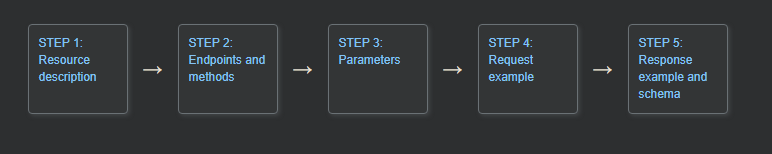

**Пять общих разделов в документах по REST API**

**Оглавление:**
- [Шаг 1: Описание ресурса(Resource description)](#шаг-1-описание-ресурсаresource-description)

Почти все справочные темы по API включают эти пять разделов:

1. **Описание ресурса**
2. **Конечные точки и методы**
3. **Параметры**
Параметры, которые можно передать конечной точке, чтобы повлиять на ответ, например, указать формат ответа или количество возвращаемых результатов.
4. **Пример запроса**
Пример запроса API, демонстрирующий, как следует обращаться к конечной точке, включая все необходимые заголовки, параметры и содержимое тела.
5. **Пример ответа и схема**

## Шаг 1: Описание ресурса(Resource description)