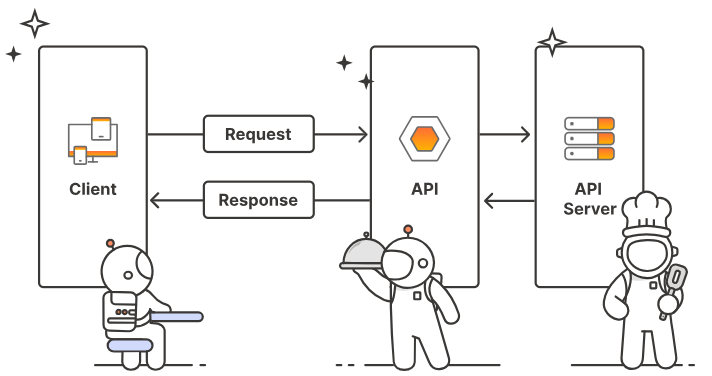

**Что такое API ?**

**Оглавление:**
- [Что такое API ?](#что-такое-api-)
- [API, использующие протокол HTTP, являются "веб-сервисами](#api-использующие-протокол-http-являются-веб-сервисами)
- [API SOAP - предшественник API REST.](#api-soap---предшественник-api-rest)
- [REST - это стиль, а не стандарт](#rest---это-стиль-а-не-стандарт)
- [REST фокусируется на ресурсах, доступ к которым осуществляется через URL-адреса.](#rest-фокусируется-на-ресурсах-доступ-к-которым-осуществляется-через-url-адреса)
- [Сам веб соответствует стандарту REST](#сам-веб-соответствует-стандарту-rest)
- [API REST не имеют статических данных и могут кэшироваться](#api-rest-не-имеют-статических-данных-и-могут-кэшироваться)
- [API REST не используют WSDL файлы, но некоторые спецификации существуют](#api-rest-не-используют-wsdl-файлы-но-некоторые-спецификации-существуют)

## Что такое API ?
В общем случае API (или Application Programming Interface) обеспечивает интерфейс между двумя системами. Это как шестеренка, которая позволяет двум системам взаимодействовать друг с другом. Разработчики используют API для преодоления пробелов между небольшими дискретными кусками кода, чтобы создавать приложения, которые являются мощными, устойчивыми, безопасными и способными удовлетворить потребности пользователей. Даже если вы их не видите, API-интерфейсы повсюду — работают непрерывно на заднем плане, чтобы обеспечить цифровой опыт, который необходим для нашей современной жизни.

## API, использующие протокол HTTP, являются "веб-сервисами

Веб-сервис - это веб-приложение, которое предоставляет ресурсы в формате, пригодном для использования другими компьютерами. Веб-сервисы включают в себя различные типы API, в том числе REST и SOAP API. По сути, веб-сервисы представляют собой взаимодействие между клиентами и серверами по принципу "запрос-ответ" (компьютер запрашивает ресурс, а веб-сервис отвечает на запрос).

Все API, использующие протокол HTTP в качестве транспортного формата для запросов и ответов, считаются "веб-сервисами". При использовании веб-сервисов клиент, делающий запрос на ресурс, и сервер API, предоставляющий ответ, могут использовать любой язык программирования или платформу - это не имеет значения, поскольку запрос и ответ передаются по общему веб-протоколу HTTP.

Веб-протокол - это часть красоты веб-сервисов: они не зависят от языка и поэтому совместимы с различными платформами и системами. При документировании REST API не имеет значения, на каком языке инженеры создают API - Java, Ruby, Python или каком-то другом. Запросы выполняются по HTTP, а ответы возвращаются по HTTP.

Между клиентом и сервером API существует запрос и ответ. Клиент и сервер могут быть основаны на любом языке, но для передачи сообщений используется протокол HTTP. Эта схема запроса и ответа является основой работы REST API.

Каждый язык программирования, на котором выполняется запрос, имеет свой способ отправки веб-запроса и разбора ответа на своем языке. Эти специфические для каждого языка функции для отправки запросов и разбора ответов не являются частью REST API (хотя они могут быть предоставлены в сопутствующем SDK). REST API не зависит от языка и обрабатывает входящую и исходящую информацию по протоколу HTTP, как и веб-интерфейс.

## API SOAP - предшественник API REST.

До того как REST стал самым популярным веб-сервисом, гораздо большее распространение получил SOAP (Simple Object Access Protocol). Чтобы лучше понять REST, необходимо иметь некоторое представление о SOAP. Так вы сможете понять, чем отличается REST.

SOAP - это стандартизированный протокол, который требует использования XML в качестве формата сообщений для запросов и ответов. Как стандартизированный протокол, формат сообщений обычно определяется в файле WSDL (Web Services Description Language).

Файл WSDL определяет допустимые элементы и атрибуты при обмене сообщениями. Файл WSDL является машиночитаемым и используется серверами, взаимодействующими друг с другом, для облегчения взаимодействия.

Сообщения SOAP заключены в "конверт", который включает в себя заголовок и тело, используя определенную XML-схему и пространство имен.

Основная проблема SOAP заключается в том, что формат XML-сообщений слишком многословен и тяжел. Это особенно проблематично в мобильных сценариях, где размер файла и пропускная способность являются критическими. Многословный формат сообщений замедляет время обработки, что делает взаимодействие по протоколу SOAP вялым.

SOAP все еще используется в сценариях корпоративных приложений (особенно в финансовых учреждениях) для связи между серверами, но за последние пять лет SOAP был в основном заменен REST.

## REST - это стиль, а не стандарт

Как и SOAP, REST (Representational State Transfer) использует HTTP в качестве транспортного протокола для запросов и ответов. Однако, в отличие от SOAP, REST - это архитектурный стиль, а не стандартный протокол. Именно поэтому REST API иногда называют RESTful API - REST - это общий стиль, которому следует API.

RESTful API может не следовать всем официальным характеристикам REST, изложенным доктором Роем Филдингом, который впервые описал эту модель. Поэтому такие API называют "RESTful" или "REST-like". (Некоторые разработчики настаивают на использовании термина "RESTful", когда API не соответствует всем характеристикам REST, но большинство людей просто называют их "REST API", независимо от этого).

Как архитектурный стиль, вы не ограничены XML в качестве формата сообщений. API REST могут использовать любой формат сообщений, который хотят использовать разработчики API, включая XML, JSON, Atom, RSS, CSV, HTML и другие.

Несмотря на разнообразие вариантов формата сообщений, большинство REST API используют JSON (JavaScript Object Notation) в качестве формата сообщений по умолчанию. Они используют JSON, потому что он обеспечивает легкий, простой и более гибкий формат сообщений, который повышает скорость обмена данными. Легкий характер JSON также позволяет использовать его в мобильных сценариях обработки и легко разбирать в Интернете с помощью JavaScript.

В отличие от XML, XSLT используется скорее для представления или, скорее, "преобразования" (буква "T" в XSLT) содержимого, хранящегося в языке XML. XSLT обеспечивает человеческую читаемость (а не обработку данных, хранящихся в формате XML).

## REST фокусируется на ресурсах, доступ к которым осуществляется через URL-адреса.

Еще один уникальный аспект REST заключается в том, что REST API фокусируются на ресурсах (то есть вещах, а не действиях) и способах доступа к ним. Ресурсы обычно представляют собой различные типы информации. Вы получаете доступ к ресурсам через URL (Uniform Resource Locators), точно так же, как при переходе по URL в браузере можно получить информационный ресурс. URL сопровождаются методом, который определяет, как вы хотите взаимодействовать с ресурсом.

К распространенным методам относятся GET (чтение), POST (создание), PUT (обновление) и DELETE (удаление). Конечная точка обычно включает в себя параметры запроса, которые указывают более подробную информацию о представлении ресурса, которое вы хотите увидеть. Например, вы можете указать (в параметре запроса), что хотите ограничить отображение 5 экземплярами ресурса.

Вот как может выглядеть пример конечной точки:

---

**``http://apiserver.com/homes/{home id}``**

---

Конечная точка показывает весь путь к ресурсу. Однако в документации вы обычно разделяете этот URL на более конкретные части:

- Базовый путь (или базовый URL, или host) относится к общему пути для API. В приведенном выше примере базовый путь  ``http://apiserver.com``.
- Конечная точка означает путь к конечной точке. В приведенном выше примере это ``/homes``.
- Часть конечной точки ``?limit=5&format=json`` содержит параметры строки запроса для конечной точки.

В приведенном выше примере эта конечная точка получит ресурс "homes" и ограничит результат 5 домами. Она вернет ответ в формате JSON.

У вас может быть несколько конечных точек, которые ссылаются на один и тот же ресурс. Вот один из вариантов:

---

**``http://apiserver.com/homes/{home id}``**

---

Приведенный выше URL может быть конечной точкой, которая извлекает домашний ресурс, содержащий определенный ID. То, что передается обратно от сервера к клиенту, является "представлением" ресурса. Ресурс может иметь множество различных представлений (показывать все дома, дома, соответствующие определенным критериям, дома в определенном формате и так далее), но здесь мы хотим увидеть дом с определенным ID.

## Сам веб соответствует стандарту REST

Терминология "GET-запросов" и "ответов-сообщений", передаваемых по "протоколу HTTP", может показаться непривычной, но это всего лишь официальная терминология REST для описания происходящего. Поскольку вы пользовались Интернетом, вы уже знакомы с тем, как работают API REST - сам Интернет, по сути, следует стилю RESTful.

Если вы открываете браузер и переходите по адресу https://idratherbewriting.com, то на самом деле вы используете протокол HTTP (https://) для отправки GET-запроса к ресурсу, доступному на веб-сервере. Ответ от сервера отправляет содержимое этого ресурса обратно вам по протоколу HTTP. Ваш браузер - это просто клиент, который придает ответу красивый вид.

Вы можете увидеть этот ответ в curl, если откроете приглашение терминала и напечатаете ``curl https://idratherbewriting.com``. (Это предполагает, что у вас установлен curl).

## API REST не имеют статических данных и могут кэшироваться

API REST также не имеют статистики и кэшируются. Stateless означает, что каждый раз, когда вы обращаетесь к ресурсу через конечную точку, API предоставляет один и тот же ответ. Он не запоминает ваш последний запрос и не учитывает его при выдаче нового ответа. Другими словами, нет никаких ранее запомненных состояний, которые API учитывал бы при каждом запросе.

Ответы также можно кэшировать, чтобы повысить производительность. Если в кэше браузера уже содержится информация, запрашиваемая в запросе, браузер может просто вернуть информацию из кэша, вместо того чтобы снова получать ресурс с сервера.

Кэширование с помощью REST API аналогично кэшированию веб-страниц. Браузер использует значение last-modified-time в HTTP-заголовках, чтобы определить, нужно ли ему снова получить ресурс. Если содержимое не было изменено с момента последнего получения, вместо него может быть использована кэшированная копия. Кэширование увеличивает скорость ответа.

## API REST не используют WSDL файлы, но некоторые спецификации существуют

Важным аспектом REST API, особенно в контексте документации, является то, что они не используют WSDL-файл для описания элементов и параметров, допустимых в запросах и ответах.

Хотя для описания REST API можно использовать файл WADL (Web Application Description Language), файлы WADL используются редко, поскольку они не могут адекватно описать все ресурсы, параметры, форматы сообщений и другие атрибуты REST API. (Помните, что REST API - это архитектурный стиль, а не стандартизированный протокол).

Чтобы понять, как взаимодействовать с REST API, необходимо прочитать документацию по API.

Для описания REST API были разработаны некоторые формальные спецификации - например, OpenAPI и RAML. Если вы описываете свой API с помощью спецификаций OpenAPI или RAML, инструменты, которые могут читать эти спецификации (например, Swagger UI или RAML API Console), будут генерировать интерактивную документацию.

Документ спецификации OpenAPI может занять место WSDL-файла, который был более распространен в SOAP. Такие инструменты, как Swagger UI, которые читают документы спецификации, обычно создают интерактивную документацию (с помощью API Consoles или API Explorers) и позволяют опробовать вызовы REST и увидеть ответы прямо в браузере.

Однако не стоит ожидать, что документация Swagger UI или RAML API Console будет содержать все детали, необходимые пользователям для работы с вашим API. Например, в них не будет информации о ключах авторизации, подробностей о рабочих процессах и взаимозависимости между конечными точками и т. д. Выходные данные Swagger или RAML обычно содержат только справочную документацию, которая, как правило, составляет лишь треть или половину от общего объема необходимой документации (в зависимости от API).

В целом, REST API более разнообразны и гибки, чем SOAP API, и вам почти всегда нужно читать документацию, чтобы понять, как взаимодействовать с REST API. В основе любого REST API лежат запрос и ответ, передаваемые по сети.
