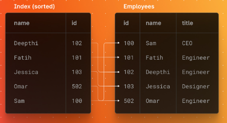

**10 лучших практик индексирования базы данных Postgres**

**Оглавление:**
- [1. Используйте правильный индекс для запроса](#1-используйте-правильный-индекс-для-запроса)
- [2. Избегайте индексов на столбцах с низкой кардинальностью](#2-избегайте-индексов-на-столбцах-с-низкой-кардинальностью)
- [3. Индексируйте только часто используемые столбцы](#3-индексируйте-только-часто-используемые-столбцы)
- [4. Не используйте слишком много индексов](#4-не-используйте-слишком-много-индексов)
- [5. Сохраняйте индексы небольшими и простыми](#5-сохраняйте-индексы-небольшими-и-простыми)
- [6. Мониторинг производительности после создания индекса](#6-мониторинг-производительности-после-создания-индекса)
- [7. Обновление статистики после добавления или удаления индекса](#7-обновление-статистики-после-добавления-или-удаления-индекса)
- [8. Рассмотрите возможность использования частичных индексов](#8-рассмотрите-возможность-использования-частичных-индексов)
- [9. Выберите хороший коэффициент заполнения](#9-выберите-хороший-коэффициент-заполнения)
- [10. Регулярно пылесосьте, чтобы избежать вздутия живота](#10-регулярно-пылесосьте-чтобы-избежать-вздутия-живота)

**Индексы** - важный инструмент для повышения производительности базы данных Postgres. Но с большой силой приходит и большая ответственность, поэтому важно использовать индексы с умом. В этой статье мы рассмотрим 10 лучших практик использования индексов в Postgres. Следуя этим рекомендациям, вы сможете убедиться в том, что ваша база данных производительна, а индексы используются эффективно.

## 1. Используйте правильный индекс для запроса
Если вы используете неправильный индекс, ваш запрос будет медленным. Если вы используете правильный индекс, ваш запрос будет быстрым. Все очень просто.

Ключом к использованию правильного индекса является понимание того, как работает ваш запрос. Вы должны знать, какие столбцы и в каком порядке вы запрашиваете. Как только вы это узнаете, вы сможете просмотреть доступные индексы и выбрать тот, который лучше всего соответствует вашему запросу.

Если вы не уверены, какой индекс использовать, вы всегда можете обратиться к оптимизатору Postgres. Оптимизатор - это встроенный инструмент, который проанализирует ваш запрос и порекомендует, какой индекс лучше использовать. Чтобы воспользоваться оптимизатором, просто добавьте в запрос ключевое слово **EXPLAIN**. Например:

`EXPLAIN SELECT * FROM my_table WHERE my_column = 'some value';`

Это выведет план, который оптимизатор выбрал для вашего запроса. Далее вы можете решить, хотите ли вы использовать другой индекс

## 2. Избегайте индексов на столбцах с низкой кардинальностью

Если столбец имеет очень мало различных значений, индекс на этом столбце будет очень маленьким и не даст большого прироста производительности. Более того, в некоторых случаях индекс на столбце с низкой кардинальностью может замедлить производительность, поскольку сам индекс необходимо сканировать при каждом запросе.

Как правило, лучше всего индексировать только те столбцы, которые имеют большое количество различных значений (высокая кардинальность). Это гарантирует, что индекс будет достаточно большим, чтобы обеспечить значительный прирост производительности, но не настолько большим, чтобы стать помехой.

## 3. Индексируйте только часто используемые столбцы

Если индексировать каждый столбец таблицы, индексы будут занимать слишком много места и замедлять операции записи. С другой стороны, если не индексировать ни одного столбца, производительность чтения будет страдать. Оптимальный вариант - где-то посередине, когда вы индексируете только те столбцы, которые чаще всего используются в запросах.

Чтобы определить, какие столбцы нужно индексировать, вы можете воспользоваться планировщиком запросов Postgres. Планировщик запросов покажет вам, какие столбцы используются в запросах и как часто они используются. Основываясь на этой информации, вы сможете решить, какие столбцы нужно индексировать.

## 4. Не используйте слишком много индексов

Если у вас слишком много индексов, ваша база данных будет работать медленнее, потому что каждый раз, когда вы вставляете, обновляете или удаляете данные, все эти индексы также должны быть обновлены. Так что если у вас есть таблица с миллионом строк и 10 индексами, каждый раз, когда вы вставляете строку, вы фактически вставляете 11 строк - одну в таблицу, а затем по одной в каждый индекс.

Со временем это может замедлить работу базы данных, поэтому важно создавать индексы только в случае крайней необходимости. Вы можете использовать команду EXPLAIN в Postgres, чтобы определить, какие индексы используются, а какие нет.

## 5. Сохраняйте индексы небольшими и простыми

Чем меньше индекс, тем меньше места на диске он будет занимать. Это важно, потому что индексы могут быстро стать большими, особенно в таблицах с большим количеством строк.

Во-вторых, маленькие индексы быстрее сканируются. Когда Postgres нужно найти данные с помощью индекса, ему придется просканировать весь индекс, чтобы найти совпадающие значения. Чем больше индекс, тем больше времени это займет.

Наконец, маленькие индексы легче поддерживать. При изменении данных индексы необходимо обновлять, чтобы отразить эти изменения. Чем сложнее индекс, тем сложнее и трудоемче поддерживать его в актуальном состоянии.

## 6. Мониторинг производительности после создания индекса

Добавление индекса в таблицу позволяет ускорить выполнение запросов, позволяя Postgres быстрее находить нужные данные. Однако индексы также занимают место и могут замедлять запись, если их использовать неразумно.

Важно следить за производительностью после создания индекса, чтобы убедиться, что он действительно помогает выполнять запросы быстрее. Если вы не видите никаких улучшений или время выполнения запросов ухудшилось, возможно, стоит удалить индекс.

В Postgres можно использовать команду **EXPLAIN**, чтобы увидеть, как используется индекс. Это может помочь понять, почему индекс не дает того прироста производительности, на который вы рассчитывали.

## 7. Обновление статистики после добавления или удаления индекса

Если не обновлять статистику после добавления или удаления индекса, оптимизатор запросов не будет иметь точной информации о распределении значений в индексированных столбцах. Это может привести к неоптимальным планам запросов и, в конечном счете, к низкой производительности.

К счастью, обновить статистику очень просто. Просто выполните команду **ANALYZE** для таблицы после добавления или удаления индекса. Например:

**``ANALYZE mytable;``**

Это приведет к обновлению статистики для всех столбцов таблицы. Если вы хотите обновить статистику только для определенного столбца, можно использовать параметр **COLUMNS**:

**``ANALYZE mytable COLUMNS mycolumn;``**

## 8. Рассмотрите возможность использования частичных индексов

Частичные индексы индексируют только подмножество строк в таблице, что может быть полезно, когда:

- Индексируемые столбцы используются только для определенного запроса или запросов.
- Индекс используется только для небольшого количества строк.
- Индекс используется только небольшим количеством запросов.

Создание частичного индекса позволяет сэкономить место и повысить производительность, поскольку индекс будет меньше и более целевым.

## 9. Выберите хороший коэффициент заполнения

Коэффициент заполнения - это процент пространства, заполненного данными на каждой странице. Более низкий коэффициент заполнения означает, что на каждой странице больше свободного места, что может быть полезно, если вы часто вставляете или обновляете данные. Однако это также означает, что каждая запись в индексе больше, что может замедлить выполнение запросов.

Более высокий коэффициент заполнения означает, что на каждой странице меньше свободного места, что может ускорить запросы, но также может замедлить вставку и обновление данных. Обычно оптимальное значение составляет около 90 %, но оно может меняться в зависимости от рабочей нагрузки.

Вы можете установить коэффициент заполнения при создании индекса, а также изменить его позже с помощью команды **ALTER INDEX**.

## 10. Регулярно пылесосьте, чтобы избежать вздутия живота

Раздутие - это когда в индексе или таблице больше страниц, чем нужно для хранения данных. Это может произойти по ряду причин, но чаще всего это связано с обновлениями или удалениями, которые еще не были пропылесошены. Когда это происходит, запросы могут замедляться, поскольку базе данных приходится сканировать больше страниц.

Чтобы избежать разрастания, необходимо регулярно пылесосить базу данных. Вы можете делать это вручную с помощью команды **VACUUM** или настроить автоматическое вакуумирование с помощью демона **autovacuum**.

Рекомендуется использовать автоматическое вакуумирование, так как в этом случае база данных будет оставаться чистой, и вам не придется помнить о необходимости делать это вручную.