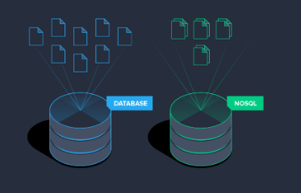
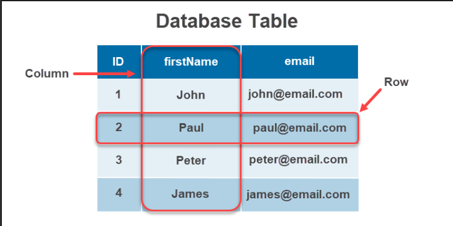
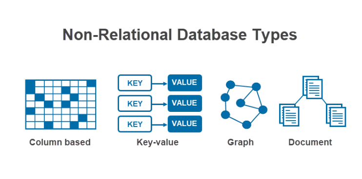

**Типы моделей баз данных**

**Оглавление:**
- [Реляционная база данных (Relational Database)](#реляционная-база-данных-relational-database)
- [Нереляционная база данных (NoSQL Database)](#нереляционная-база-данных-nosql-database)
- [Объектно-ориентированная база данных (Object Database)](#объектно-ориентированная-база-данных-object-database)

Разница между моделями заключается в том, как информация выглядит в базе данных. Следовательно, каждый тип модели имеет свою систему управления и взаимосвязи данных.

## Реляционная база данных (Relational Database)

Реляционная модель баз данных - наиболее широко используемый и самый старый тип баз данных. Три важнейших компонента реляционной базы данных:

- Таблицы. Тип сущности с отношениями.
- Строки. Записи или экземпляры типа сущности.
- Столбцы. Атрибуты значений экземпляров.

Реляционная база данных предоставляет набор строк данных в ответ на запрос. Язык запросов, чаще всего Structured Query Language или SQL, помогает создать эти представления данных.

Особенности реляционной базы данных

Основными характеристиками реляционной базы данных являются:

- **Совместимость с ACID**. База данных восстанавливает целостность при выполнении транзакций.
- **Диапазон типов данных**. Обеспечивает возможность хранения любых данных, а также выполнения сложных запросов.
- **Совместная работа**. Несколько пользователей могут получить доступ к базе данных и работать над одним проектом.
- **Безопасность**. Доступ ограничивается или ограничивается с помощью прав доступа пользователей.
- **Стабильность**. Реляционные базы данных хорошо понятны и документированы.

**Для чего используются реляционные базы данных?**

Реляционные базы данных являются наиболее распространенным типом баз данных. Существует множество вариантов их использования, некоторые из которых включают:

- **Системы онлайн-транзакций**. База данных поддерживает множество пользователей, а также частые запросы, необходимые при проведении онлайн-транзакций.
- **IoT**. Реляционные базы данных легковесны и обладают вычислительной мощностью, необходимой для пограничных вычислений.
- **Хранилища данных**. Важнейшим компонентом архитектуры хранилища данных является хранилище. Реляционные базы данных легко интегрируются и оптимизируются для массовых запросов из разных источников.

**Самые популярные реляционные базы данных**

Существует бесчисленное множество коммерческих баз данных, а также баз данных с открытым исходным кодом. В десятку самых популярных реляционных баз данных входят:

1. Oracle

2. MySQL

3. Microsoft SQL Server

4. PostgreSQL

5. IBM Db2

6. SQLite

## Нереляционная база данных (NoSQL Database)

Нереляционная база данных, или NoSQL ("Not Only SQL"), - это тип базы данных, который моделирует и хранит данные иначе, чем реляционные базы данных. Вместо таблиц нереляционные базы данных моделируют отношения между данными альтернативным способом.

К 4 типам баз данных NoSQL относятся:

- **Column based**
- **Key-value**
- **Graph**
- **Document**

**Основными особенностями нереляционных баз данных являются:**

- **Гибкость**. Работа со структурированными, полуструктурированными и неструктурированными данными не составит труда при использовании нереляционных типов баз данных.
- **Масштабируемость и оперативность**. Массивные хранилища данных хорошо масштабируются с серверами, работающими по требованию, и обеспечивают быстрые ответы на запросы.
- **Нулевое время простоя**. Высокая доступность при минимальном времени простоя благодаря репликации данных практически в режиме реального времени.
- **Совместимость с облаками**. Масштабируемость архитектуры облачных вычислений прекрасно сочетается с нереляционными базами данных.
- **Множественные структуры данных**. Доступны различные типы информации, а также многомодельные форматы баз данных.

**Для чего используются нереляционные базы данных?**

Для чего используются нереляционные базы данных?

Нереляционные базы данных лучше всего работают с переменными структурами данных и огромными объемами данных. Некоторые примеры использования включают:

- **Системы реального времени**. Нереляционная база данных объединяет операционную и аналитическую системы баз данных в одну. Независимо от того, поступают ли оперативные данные в Hadoop или результаты аналитики поступают из Hadoop, нереляционные базы данных обеспечивают гибкость работы в режиме реального времени.
- **Персонализированный опыт**. Эластичное масштабирование позволяет обрабатывать огромные объемы данных, необходимые для любого персонализированного опыта.
- **Обнаружение мошенничества**. Высокая производительность жизненно важна для выявления мошенничества. Нереляционные базы данных быстро реагируют и надежно отвечают требованиям финансовых систем к низкой задержке.

**Самые популярные нереляционные базы данных**

1. MongoDB

2. Redis

3. Cassandra

4. HBase

5. Neo4j

## Объектно-ориентированная база данных (Object Database)

**Object database** аналогично представляет данные объектам в объектно-ориентированном программировании. Важнейшими компонентами объектно-ориентированной базы данных являются:

- **Объекты**. Основные строительные блоки для хранения информации.
- **Классы**. Схема или чертеж объекта.
- **Методы**. Структурированное поведение класса.
- **Указатели**. Доступ к элементам базы данных и установление отношений между объектами.

**Особенности базы данных объектов**

Основными особенностями объектных баз данных являются:

- **ACID-транзакции**. Все транзакции завершаются без противоречивых изменений благодаря соответствию ACID.
- **Прозрачная персистентность**. Объектные базы данных легко интегрируются с объектно-ориентированными языками программирования.
- **Сложные и пользовательские типы данных**. Определяемые пользователем классы позволяют создавать как пользовательские, так и сложные типы данных.
- **Доступность**. Данные легко сохранять и извлекать.
- **Более простое моделирование**. Проблемы и информация реального мира более тесно связаны с объектами, что облегчает моделирование сложных проблем.

**Для чего используются Object Database?**

Объектные базы данных лучше всего работают со сложными типами данных, когда одна сущность содержит огромное количество информации. Некоторые повседневные случаи использования этого типа модели базы данных:

- **Высокопроизводительные приложения**. Приложения, в которых быстрый поиск данных жизненно важен, выигрывают от использования объектных баз данных, поскольку данные хранятся и извлекаются как есть.
- **Научные цели**. Научные данные, как и вычисления, являются сложными. Хранение сложной информации и быстрый поиск находят применение в самых разных научных дисциплинах.
- **Сложные структуры данных**. Благодаря постоянной персистентности объектов хранение и расширение базы данных для сложных данных становится доступным, что избавляет от необходимости переделывать модель базы данных.

**Самые популярные объектные базы данных**

1. DB4o

2. ObjectStore

3. Matisse

4. Gemstone/S

5. ObjectDB

6. ObjectDatabase++

7. Objectivity/DB

8. Versant

9. Perst

10. Jade