**Типы индексов базы данных Postgres**

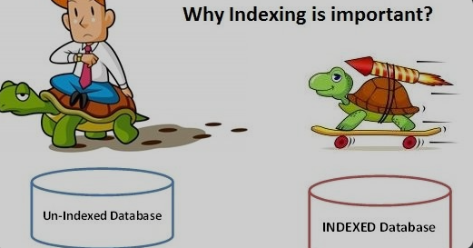

**Оглавление:**
- [B-tree indexes](#b-tree-indexes)
- [Hash index](#hash-index)
- [GiST indexes](#gist-indexes)
- [SP-GiST indexes](#sp-gist-indexes)
- [GIN indexes](#gin-indexes)
- [BRIN index](#brin-index)
- [List indexes in Postgres](#list-indexes-in-postgres)
- [Важные рекомендации по работе с индексами Postgres](#важные-рекомендации-по-работе-с-индексами-postgres)

Индексы играют важную роль в производительности запросов любой реляционной базы данных. Индекс обеспечивает возможность прямого доступа к страницам данных. Он похож на оглавление книги, где вы можете напрямую перейти к определенной странице, обратившись к ключевому слову в оглавлении. Представьте себе книгу без индекса. Если вам нужна информация о ключевом слове, вам пришлось бы просмотреть все страницы.

## B-tree indexes

B-tree - это индекс по умолчанию в Postgres, который лучше всего использовать для поиска по определенным значениям, сканирования диапазонов, сортировки данных или сопоставления шаблонов. Если в команде CREATE INDEX не указан конкретный тип индекса, Postgres создает индекс B-дерева, который следует алгоритму Lehman & Yao и B+-деревьям.

На высоком уровне B-дерево имеет корневой, промежуточный и листовой узлы.

- Корневой и промежуточный узлы содержат ключи и указывают на узлы нижнего уровня.
- Узел Leaf содержит ключи, а также данные, указывающие на кучу.

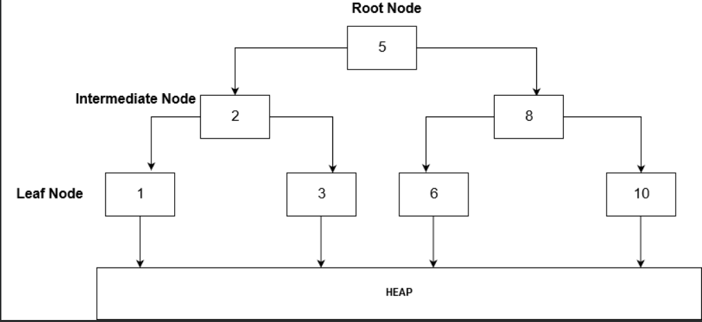

Я создал таблицу "public". "addresses". Эта таблица содержит 100 000 строк.

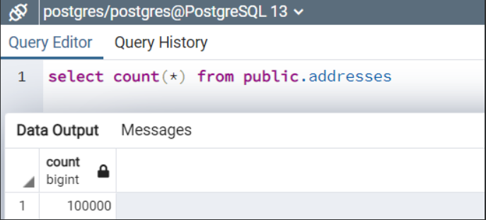

В настоящее время таблица **[addresses]** не имеет индекса. Поэтому, если мы создадим план выполнения оператора **SELECT**, он выполнит последовательное сканирование.

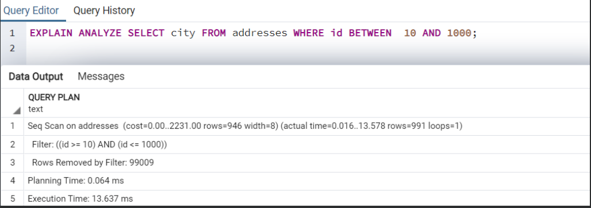

**Postgres** автоматически создает индекс B-дерева, если мы определяем первичный или уникальный ключ в таблице. Вы также можете определить индекс для нескольких столбцов (составной ключ). В данном примере мы воспользуемся оператором CREATE INDEX и определим индекс для столбца ID.

---
**``CREATE INDEX IX_Addresses_id on addresses(id);``**

**``EXPLAIN ANALYZE SELECT city FROM addresses WHERE id BETWEEN 10 AND 1000;``**

---

Как только Postgres создаст индекс B-дерева на столбце ID, это улучшит производительность.

- Выполнение запроса с индексом заняло 0,266 мс по сравнению с 13,637 мс без индекса.
- При этом используется индексное сканирование по сравнению с последовательным сканированием, которое является дорогостоящим оператором.

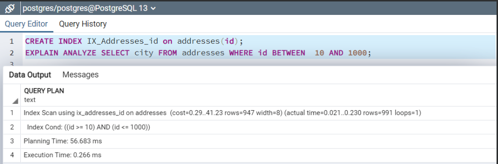

## Hash index

Hash index лучше всего подходят для работы с операторами равенства. Оператор равенства ищет точное совпадение данных. Начиная с версии Postgres 9.x, хэш-индексы записываются в журнал WAL и безопасны при сбоях.

В следующем операторе CREATE INDEX мы создаем хэш-индекс на столбце "City" (Using HASH(“City”).

---

**``CREATE INDEX IX_Addresses_city on addresses using HASH("city");``**

---

Теперь давайте поищем записи по адресам, чей город равен ZQ.

---

**``EXPLAIN ANALYZE SELECT city FROM addresses WHERE city = ('ZQ')``**

---

В операторе SELECT используется хэш-индекс, поскольку мы указали оператор равенства.

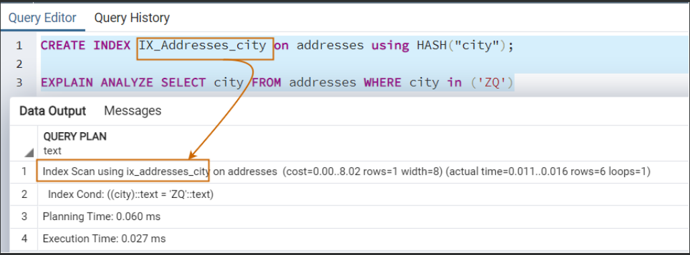

Как было сказано выше, hash index работает с оператором равенства. Если мы указываем отдельный оператор, например (pattern matching), он не использует hash index, как показано на следующем изображении. Поэтому вам следует создать этот индекс, если ваша рабочая нагрузка требует много поисков, основанных на равенстве данных.

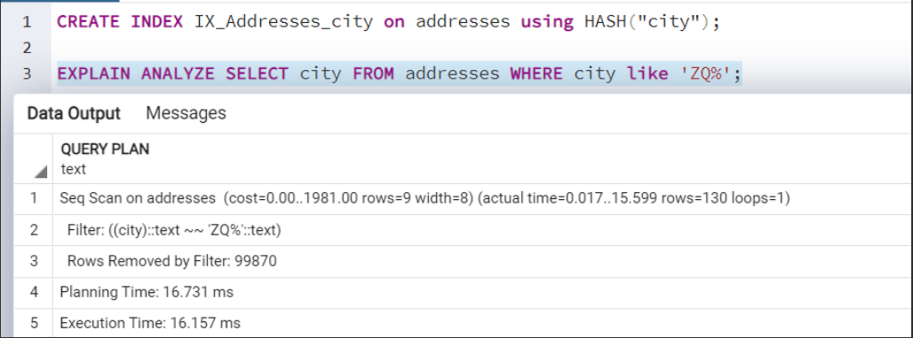

## GiST indexes

Обобщенное дерево поиска (GiST) является сбалансированным и реализует схемы индексирования новых типов данных в привычной сбалансированной древовидной структуре. Оно может индексировать сложные данные, такие как геометрические данные и данные сетевых адресов. В нем также могут быть реализованы различные стратегии, такие как B-дерево или R-дерево.

Например, в приведенном ниже запросе мы создаем таблицу [demodata] для хранения типа данных point. Он определяет точку на плоскости.

---

**``Create table demodata ( p point);
insert into demodata(p) values
(point '(23,11)'), (point '(37,35)'), (point '(41,1)'),
(point '(55,25)');``**

---

В этой таблице я храню координаты прямоугольника. Для этого я использую mathopenref для рисования прямоугольника и определения его координат.

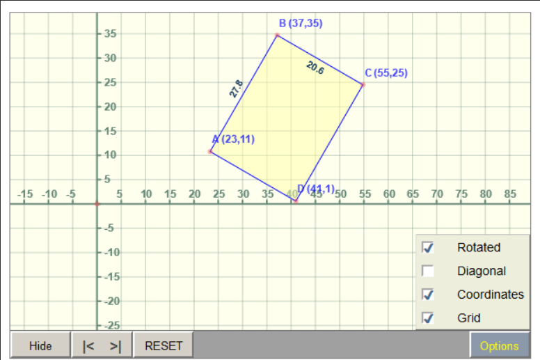

Если не создавать индексы Postgres и не искать точки в прямоугольнике, то он пройдет через последовательное сканирование.

---

**``explain ANALYZE select * from demodata where p <@ box '(23,12),(37,35)';``**

---

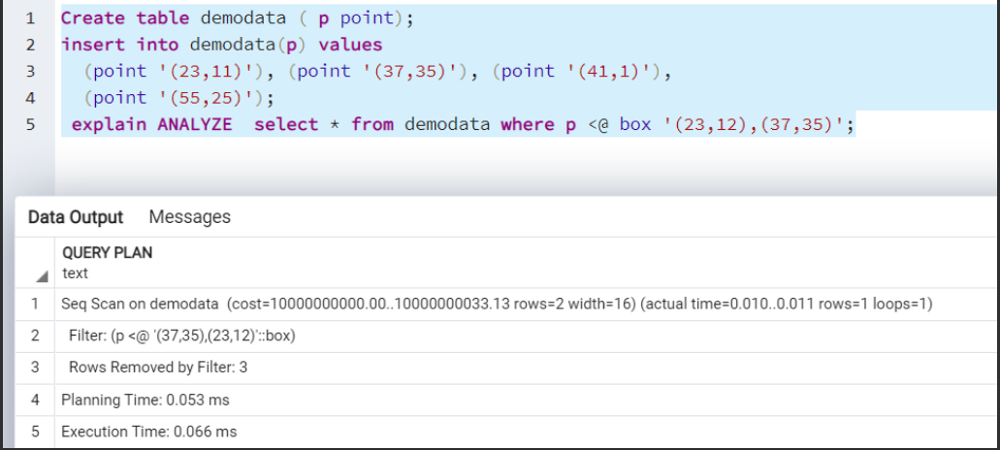

Теперь мы определим индекс GiST и повторно запустим оператор SELECT.

---

**``create index on demodata using gist(p);
explain ANALYZE select * from demodata where p <@ box '(23,12),(37,35)';``**

---

Для получения результатов используется сканирование по индексу GiST.

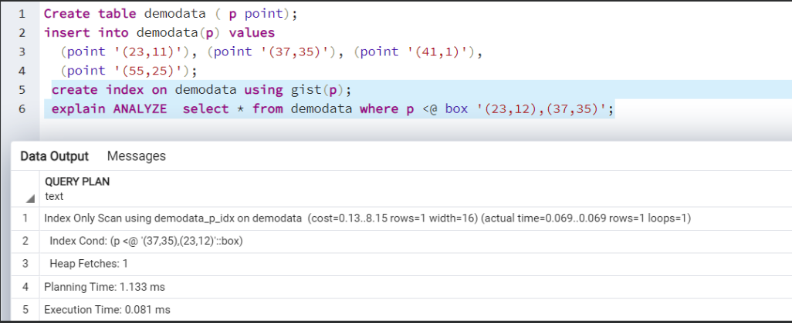

## SP-GiST indexes

Индекс SP-GiST - это индекс GiST с пространственным разделением. Он полезен для индексирования несбалансированных структур данных с использованием дерева поиска с разбиением.

Он лучше всего подходит для перекрывающихся геометрий и неоднородных распределений. Он может реализовывать различные деревья, такие как квадродеревья, k-d деревья и радиксные деревья.

В приведенном ниже примере мы создаем индекс SP-GiST на таблице демоданных для поиска координат в прямоугольнике.

---

**``Create table demodata ( p point);
Insert into demodata(p) values
(point '(23,11)'), (point '(37,35)'), (point '(41,1)'),
(point '(55,25)');
Create index on demodata using spgist(p);
explain ANALYZE select * from demodata where p <@ box '(23,12),(37,35)';``**

---

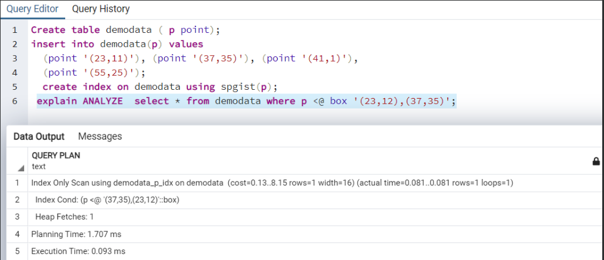

## GIN indexes

Обобщенный инвертированный индекс (GIN) полезен для индексирования столбцов, имеющих составные типы. Он лучше всего подходит для таких типов данных, как JSONB, Array, Range, а также для полнотекстового поиска.

Предположим, у вас есть база данных каталогов, в которой пользователи могут осуществлять поиск по базе данных, используя частичные совпадения. Например, если пользователь вводит в поисковую строку "raj", он должен вернуть все строки с такими именами, как  Rajendra, Raju and Hansraj. В этом случае мы можем реализовать индекс GIN для выполнения оптимизированных по производительности запросов.

Для демонстрации у меня есть таблица [employeesdata] с 1 000 000 строк. В ней есть два столбца, имя_и фамилия. Предположим, пользователи хотят получить количество записей обо всех, чье имя выглядит как %raj%, а фамилия - как '%aec%.

Если мы запустим оператор SELECT без создания индексов, то на получение данных уйдет около 5455 мс.

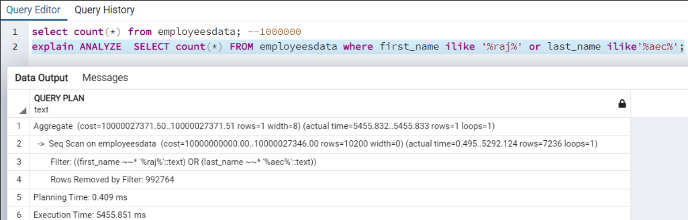

Теперь, если мы создадим индекс GIN для столбцов first_name и last_name с помощью опции gin_trms_ops, это даст указание Postgres использовать триграммы для выбранных столбцов.

Когда мы повторно запускаем запрос после применения индекса GIN, он работает быстрее. Он извлекает результаты за 64 мс по сравнению с 5455 мс (без индекса).

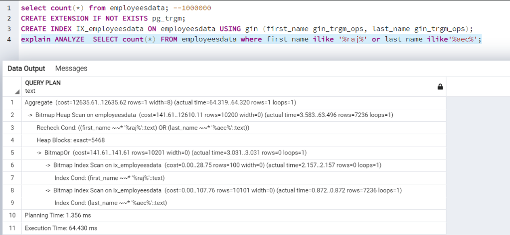

## BRIN index

Индекс BRIN также известен как индекс диапазона блоков. В нем хранится сводная информация о блоках (минимальное значение, максимальное значение и номер страницы). Как только BRIN-индекс реализован, он использует значения BRIN для проверки каждой страницы. Если страница не изменяется, ее значение BRIN остается неизменным. Теперь, когда мы задаем запрос для получения результата, он использует минимальный и максимальный диапазон значений, чтобы проверить, удовлетворяет ли страница набору результатов. Этот метод полезен для обширных данных, таких как временные метки и данные датчиков температуры. Кроме того, он занимает меньше места по сравнению с индексом B-дерева.

У меня есть таблица [Tempraturesensors], в которой около 3 миллиардов строк. Предположим, нам нужна минимальная температура для определенного диапазона дат. Для извлечения данных без создания индексов потребуется 16083 мс.

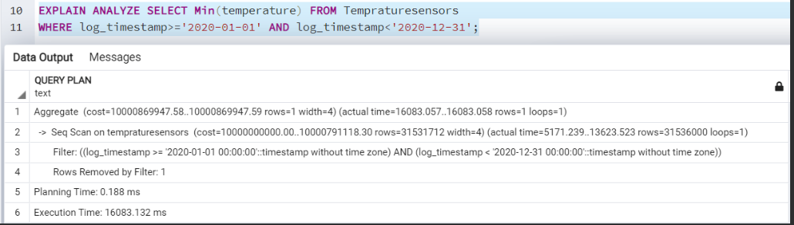

После создания индекса BRIN и повторного выполнения запроса он быстро выдает нам результат. Он возвращает результаты за 7652 мс по сравнению с 16083 мс при получении данных без индекса.

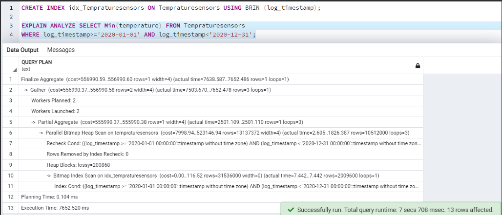

## List indexes in Postgres

Предположим, вам нужен список индексов для всех объектов в определенной схеме или конкретной таблице. Для этого мы можем использовать представление pg_indexes. Оно возвращает определение индекса, а также сам индекс. В приведенном ниже запросе оно возвращает информацию об индексах для всех таблиц в публичной схеме.

---

**``SELECT
tablename as "TableName",
indexname as "Index Name",
indexdef as "Index script"
FROM
pg_indexes
WHERE
schemaname = 'public'
ORDER BY
tablename,
indexname;``**

---

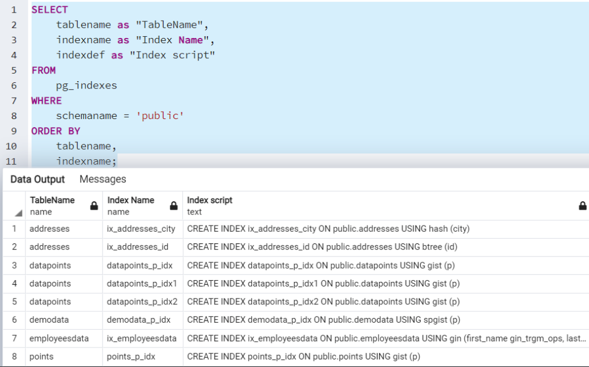

## Важные рекомендации по работе с индексами Postgres

- Индекс Postgres по умолчанию - это индекс B-дерева.
- Для определения подходящего типа индекса Postgres всегда следует правильно анализировать рабочую нагрузку с помощью планов выполнения запросов.
- Всегда создавайте индексы для наиболее часто выполняемых и дорогостоящих запросов. Избегайте создания индекса для удовлетворения конкретного запроса.
- Согласно лучшей практике, всегда определяйте первичный или уникальный ключ в таблице Postgres. Он автоматически создает индекс B-дерева.
- Избегайте создания нескольких индексов для одного столбца. - Лучше посмотреть, какой индекс подходит для вашей рабочей нагрузки, и отказаться от ненужных индексов.
- Не существует конкретного ограничения на количество индексов в таблице, однако старайтесь создавать минимальное количество индексов, удовлетворяющее вашей рабочей нагрузке.

