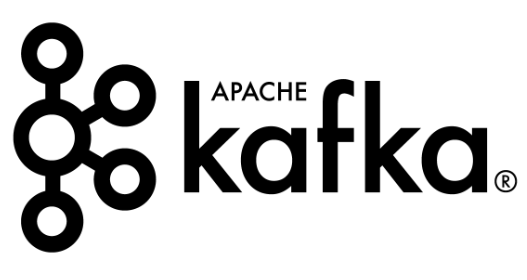
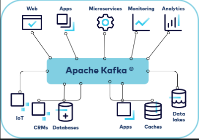
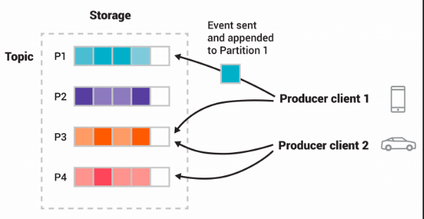

**Что такое Kafka?**

**Оглавление:**
- [События и потоковая передача событий](#события-и-потоковая-передача-событий)
- [Примеры использования](#примеры-использования)
- [Терминология](#терминология)
  - [Брокеры (Brokers)](#брокеры-brokers)
  - [Темы (Topics)](#темы-topics)
  - [Продюсер (Producers)](#продюсер-producers)
  - [Потребители (Consumers)](#потребители-consumers)
  - [Partitions](#partitions)
  - [Репликация (Replication)](#репликация-replication)
- [Компоненты](#компоненты)
  - [Kafka Connect](#kafka-connect)
  - [Kafka Streams](#kafka-streams)
- [Для чего используется Kafka?](#для-чего-используется-kafka)

Apache Kafka - это платформа для потоковой передачи данных с открытым исходным кодом, которая предназначена для обработки больших объемов данных в реальном времени и отказоустойчива. Ключевыми концепциями являются:

## События и потоковая передача событий

Чтобы более подробно разобраться в распределенной потоковой передаче событий, сначала нужно понять, что событие - это запись о том, что "что-то произошло" в мире или в вашем бизнесе. Например, в системе поездок на автомобиле вы можете увидеть следующее событие:

---

- Ключ события: "Алиса"
- Значение события: "Запрошена поездка на рабочее место".
- Временная метка события: "25 июня 2024 года в 14:06".

---

Данные о событиях описывают, что произошло, когда и кто в этом участвовал. Потоковая передача событий - это практика захвата событий, подобных приведенному примеру, в режиме реального времени из таких источников, как базы данных, датчики, мобильные устройства, облачные сервисы и программные приложения.

Платформа потоковой передачи событий фиксирует события по порядку, и эти потоки событий долго хранятся для обработки, манипулирования и реагирования на них в режиме реального времени или для последующего извлечения. Кроме того, потоки событий могут быть направлены на различные технологии назначения по мере необходимости. Потоковая передача событий обеспечивает непрерывный поток и интерпретацию данных, благодаря чему нужная информация оказывается в нужном месте и в нужное время.

Для этого Kafka запускается в виде кластера на одном или нескольких серверах, которые могут располагаться в нескольких центрах обработки данных, и обеспечивает распределенную, высокомасштабируемую, эластичную, отказоустойчивую и безопасную функциональность. Кроме того, Kafka может быть развернута на пустом оборудовании, виртуальных машинах, контейнерах, как в локальных, так и в облачных средах.

## Примеры использования

Потоковая передача событий применяется в самых разных отраслях и организациях. Например:

- В качестве системы обмена сообщениями. Например, Kafka может использоваться для обработки платежей и финансовых транзакций в режиме реального времени, например, на фондовых биржах, в банках и страховых компаниях.
- Отслеживание активности. Например, Kafka можно использовать для отслеживания и мониторинга легковых и грузовых автомобилей, автопарков и грузов в режиме реального времени, например, для служб такси, в логистике и автомобильной промышленности.
- Сбор данных. Например, Kafka можно использовать для непрерывного сбора и анализа данных с датчиков IoT-устройств или другого оборудования, например, на заводах и ветряных электростанциях.
- Для потоковой обработки. Например, используйте Kafka для сбора и реагирования на взаимодействие с клиентами и их заказы, например, в розничной торговле, гостиничном и туристическом бизнесе, а также в мобильных приложениях.
- Разделение системы. Например, используйте Kafka для соединения, хранения и обеспечения доступности данных, производимых различными подразделениями компании.
- Интеграция с другими технологиями работы с большими данными, такими как Hadoop.

## Терминология

Kafka - это распределенная система, состоящая из различных типов серверов и клиентов, которые передают события по высокопроизводительному сетевому протоколу TCP. Все эти серверы и клиенты предназначены для совместной работы. Ниже приведены некоторые ключевые термины, с которыми вы должны быть знакомы:

### Брокеры (Brokers)
Брокер - это сервер в слое хранения Kafka, который хранит потоки событий из одного или нескольких источников. Кластер Kafka обычно состоит из нескольких брокеров. Каждый брокер в кластере также является загрузочным сервером, то есть если вы можете подключиться к одному брокеру в кластере, вы сможете подключиться ко всем брокерам.

### Темы (Topics)

Кластер Kafka организует и долговременно хранит потоки событий в категориях, называемых темами, которые являются наиболее фундаментальной единицей организации Kafka. Тема - это журнал событий, подобный папке в файловой системе, где события - это файлы в этой папке.

Тема имеет следующие характеристики:

- Тема предназначена только для добавления: Когда в тему записывается новое сообщение о событии, оно добавляется в конец журнала.
- События в этой теме неизменяемы, то есть их нельзя изменить после записи.
- Потребитель считывает журнал, ища смещение, а затем считывая записи журнала, которые следуют за ним последовательно.
- Темы в Kafka всегда являются мультипроизводителями и мультиподписчиками: у темы может быть ноль, один или много производителей, которые пишут в нее события, а также ноль, один или много потребителей, которые подписываются на эти события.

Темы нельзя запросить, однако события в теме можно читать так часто, как это необходимо, и, в отличие от других систем обмена сообщениями, события не удаляются после их использования. Вместо этого темы могут быть настроены на удаление данных по достижении ими определенного возраста или по достижении темой определенного размера. Производительность Kafka фактически постоянна в зависимости от размера данных, поэтому хранение данных в течение длительного времени должно оказывать номинальное влияние на производительность.

Kafka предоставляет несколько инструментов CLI, которые можно использовать для управления кластерами, брокерами и темами, а также API Admin Client, чтобы вы могли реализовать собственные инструменты администрирования.

### Продюсер (Producers)

Продюсеры - это клиенты, которые пишут события в Kafka. Производитель указывает темы, в которые он будет писать, и контролирует, как события распределяются по разделам внутри темы. Это может быть сделано по круговой системе для балансировки нагрузки или в соответствии с некоторой семантической функцией разделения, например по ключу события.

Kafka предоставляет Java Producer API, позволяющий приложениям отправлять потоки событий в кластер Kafka.

### Потребители (Consumers)

Потребители - это клиенты, которые читают события из Kafka.

Единственные метаданные, сохраняемые для каждого потребителя, - это смещение или позиция потребителя в теме. Это смещение контролируется потребителем. Обычно потребитель продвигается вперед линейно по мере чтения записей, однако, поскольку позиция контролируется потребителем, он может потреблять записи в любом порядке. Например, потребитель может вернуться к более старому смещению, чтобы обработать данные из прошлого, или пропустить вперед самую последнюю запись и начать потребление с "настоящего момента".

Такое сочетание возможностей означает, что потребители Kafka могут приходить и уходить без особого влияния на кластер или других потребителей.

Kafka предоставляет Java Consumer API для того, чтобы приложения могли читать потоки событий из кластера Kafka.

### Partitions

Темы разбиваются на разделы, то есть журнал одной темы разбивается на несколько журналов, расположенных на разных брокерах Kafka. Таким образом, работа по хранению сообщений, написанию новых и обработке существующих сообщений может быть распределена между многими узлами кластера. Такое распределенное размещение данных очень важно для масштабируемости, поскольку позволяет клиентским приложениям одновременно читать и записывать данные с/на множество брокеров.

Когда новое событие публикуется в теме, оно фактически добавляется в один из разделов темы. События с одинаковым ключом события, например, с одинаковым идентификатором клиента или идентификатором автомобиля, записываются в один и тот же раздел, и Kafka гарантирует, что любой потребитель данного раздела темы всегда будет читать события этого раздела в том же порядке, в каком они были записаны.

Тема, изображенная на рисунке, состоит из четырех разделов P1-P4. Два разных клиента-производителя независимо друг от друга публикуют новые события в этой теме, записывая события по сети в разделы темы. События с одинаковым ключом, которые на изображении показаны разными цветами, записываются в один и тот же раздел. Обратите внимание, что оба производителя могут писать в один и тот же раздел, если это необходимо.

### Репликация (Replication)
Репликация - важная составляющая обеспечения высокой доступности и отказоустойчивости ваших данных. Каждая тема может быть реплицирована, даже между георегионами или центрами обработки данных. Это означает, что у нескольких брокеров всегда есть копия данных на случай, если что-то пойдет не так, вы захотите провести обслуживание брокеров и т. д. Обычной производственной настройкой является коэффициент репликации 3, что означает, что у вас всегда будет три копии данных. Эта репликация выполняется на уровне разделов темы.

## Компоненты

Помимо брокеров, производителей и потребителей клиентов, в Kafka есть и другие ключевые компоненты, с которыми вы должны быть знакомы:

### Kafka Connect
Kafka Connect - это компонент Kafka, который обеспечивает интеграцию данных между базами данных, хранилищами ключевых значений, поисковыми индексами, файловыми системами и брокерами Kafka. Kafka Connect предоставляет общую структуру для определения коннекторов, которые выполняют работу по перемещению данных в Kafka и из него.

Существует два различных типа коннекторов:

- Исходные коннекторы, которые выступают в роли производителей для Kafka
- Sink connectors которые выступают в роли потребителей для Kafka

Вы можете использовать один из многочисленных коннекторов, предоставляемых сообществом Kafka, или использовать API Connect для создания и запуска собственных коннекторов импорта/экспорта данных, которые потребляют (читают) или создают (пишут) потоки событий из внешних систем и приложений.

### Kafka Streams

В Kafka потоковый процессор - это все, что принимает непрерывные потоки данных от входных тем, выполняет некоторую обработку этих данных и выдает непрерывные потоки данных в выходные темы. Например, приложение для организации поездок может принимать на вход потоки данных о водителях и клиентах, а на выходе выдавать поток данных о поездках, которые происходят в данный момент.

Вы можете выполнять простую обработку непосредственно с помощью API производителей и потребителей. Однако для более сложных преобразований Kafka предоставляет потоки Kafka Streams.

Kafka Streams - это клиентская библиотека для создания критически важных приложений и микросервисов реального времени, в которых входные и/или выходные данные хранятся в кластерах Kafka. С помощью Kafka Streams можно создавать приложения, которые выполняют нетривиальные задачи обработки, вычисляя агрегированные данные из потоков или объединяя потоки вместе.

Потоки помогают решить такие проблемы, как обработка неупорядоченных данных, повторная обработка входных данных при изменении кода, выполнение вычислений с учетом состояния и т. д.

Streams опирается на основные примитивы Kafka, в частности, он использует:

- API производителей и потребителей для ввода данных Kafka для хранения данных в состоянии
- Тот же групповой механизм для обеспечения отказоустойчивости среди экземпляров потоковых процессоров

## Для чего используется Kafka?

Apache Kafka находит широкое применение в потоковой передаче данных в реальном времени, архитектурах, управляемых событиями, и разработке конвейеров данных. Вот несколько примеров применения:

**1. Агрегация журналов**: Централизация журналов для мониторинга
**2. Аналитика в режиме реального времени**: Обрабатывает пользовательские данные для получения рекомендаций
**3. Event Sourcing**: Записи точных финансовых операций
**4. Конвейеры данных**: Передача данных между системами
**5. Потоковая передача данных IoT**: Управление данными датчиков IoT
**6. Машинное обучение**: Пердача данных в модели ML
**7. Обнаружение мошенничества:** Выявление аномалий в режиме реального времени
**8. Хранение данных**: Обеспечивает мгновенный анализ
