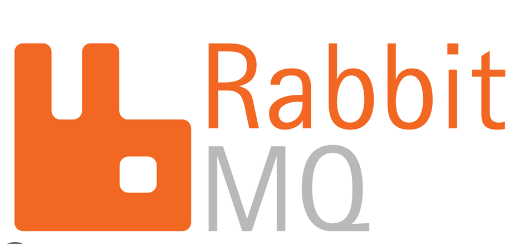

**Что такое RabbitMQ?**

**Оглавление:**
- [Что такое RabbitMQ?](#что-такое-rabbitmq)
- [Когда использовать RabbitMQ?](#когда-использовать-rabbitmq)

## Что такое RabbitMQ?

RabbitMQ, брокер сообщений с открытым исходным кодом, обеспечивает эффективную связь между программными компонентами через AMQP. Он выступает в роли посредника, позволяя распределенным системам надежно обмениваться сообщениями. RabbitMQ разделяет отправку и получение сообщений, повышая масштабируемость и отказоустойчивость.

Рассмотрим приложение для электронной коммерции; RabbitMQ помогает отделить обработку заказов от фронт-энда, обеспечивая оперативность реагирования.

**1. Очередь сообщений**:

RabbitMQ использует очереди сообщений для временного хранения и обработки сообщений. Например, веб-приложение может отправлять данные о заказе в RabbitMQ, когда клиент оформляет заказ.

**2. Producers and Consumers**:

- **Producer**: Producer - это веб-приложение, отправляющее сообщения в RabbitMQ.

- **Consumer**: Consumer - это веб-приложение, отправляющее сообщения в RabbitMQ.

**3. Decoupling and Scaling**:

RabbitMQ обеспечивает независимое масштабирование веб-приложения и бэкенда обработки заказов, гарантируя отзывчивость даже при добавлении дополнительных экземпляров бэкенда.

**4. Example Scenario**:

RabbitMQ предотвращает потерю заказов или задержки во время высокого трафика. Он ставит заказы в очередь и обрабатывает их, когда бэкэнд становится доступным.

**5. Acknowledgements and Reliability**:

RabbitMQ обеспечивает надежность сообщений с помощью подтверждений. Если обработка прошла успешно, а подтверждение не получено, он повторно ставит сообщение в очередь, чтобы предотвратить потерю.

**6. Use Cases**:

**Распределенные системы**: RabbitMQ используется в архитектурах микросервисов, где различные компоненты должны взаимодействовать без жесткой связи.

**Фоновая обработка**: Используется для разгрузки ресурсоемких задач на фоновые рабочие.

**Архитектуры, управляемые событиями**: RabbitMQ подходит для трансляции событий и уведомлений заинтересованным подписчикам.

**IoT и сенсорные данные**: Используется для управления и обработки больших объемов данных, генерируемых устройствами IoT.

## Когда использовать RabbitMQ?

RabbitMQ - это универсальный, надежный и масштабируемый брокер сообщений для раздельного взаимодействия систем. Вот несколько примеров того, когда можно использовать RabbitMQ:

**1. Распределение задач и балансировка нагрузки**:

Распределите задания между работниками для организованной обработки

**2. Фоновая обработка**:

Разгрузите трудоемкие задачи, чтобы обеспечить отзывчивый пользовательский опыт

**3. Архитектура, управляемая событиями**:

Обеспечьте гибкую связь между компонентами системы

**4. Потоки данных в реальном времени**:

Передача обновлений в режиме реального времени с низкой задержкой связи

**5. Коммуникация микросервисов**:

Подключение микросервисов для бесперебойной обработки данных

**6. Приложения Интернет вещей**:

Поддержка передачи данных IoT и анализа в режиме реального времени

**7. Асинхронная коммуникация**:

Облегчение неблокируемого обмена сообщениями

**8. Механизмы обработки ошибок и повторных попыток**:

Обеспечьте надежную обработку сообщений и устранение неполадок

