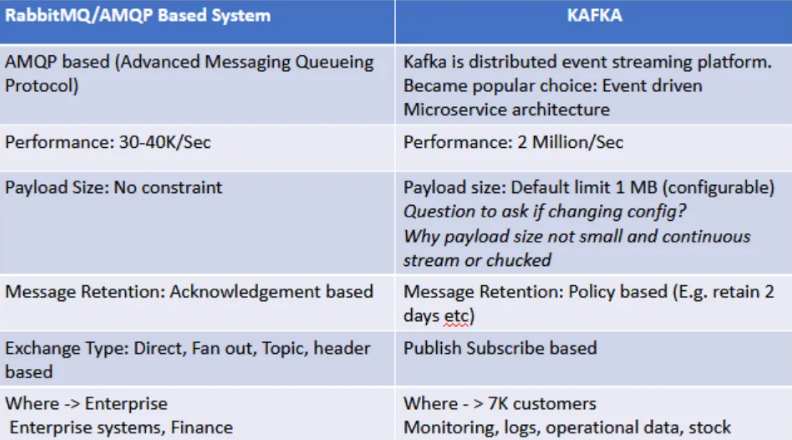
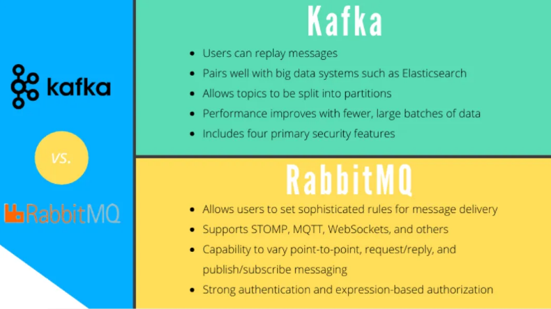
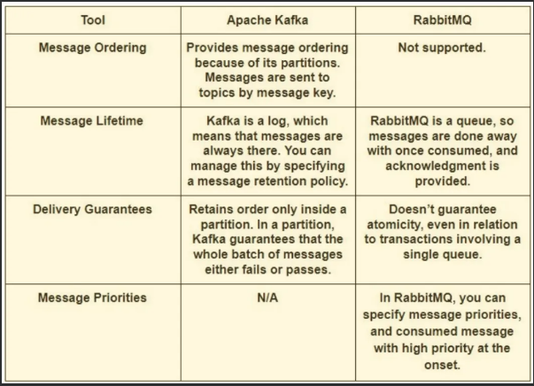

**Система на основе RabbitMQ/AMQP в сравнении с Kafka**

**Оглавление:**
- [1. Модель обмена сообщениями:](#1-модель-обмена-сообщениями)
- [2. Примеры использования:](#2-примеры-использования)
- [3. Сохранение и постоянство данных:](#3-сохранение-и-постоянство-данных)
- [4. Масштабируемость:](#4-масштабируемость)
- [5. Отказоустойчивость:](#5-отказоустойчивость)
- [6. Задержка:](#6-задержка)
- [7. Экосистема и интеграции:](#7-экосистема-и-интеграции)
- [Особенности RabbitMQ](#особенности-rabbitmq)
  - [1. AMQP (Advanced Message Queuing Protocol):](#1-amqp-advanced-message-queuing-protocol)
  - [2. Брокер сообщений:](#2-брокер-сообщений)
  - [3. Erlang:](#3-erlang)
  - [4. OTP:](#4-otp)
- [Преимущества RabbitMQ](#преимущества-rabbitmq)
  - [1. Надежная доставка сообщений:](#1-надежная-доставка-сообщений)
  - [2. Гибкие шаблоны обмена сообщениями:](#2-гибкие-шаблоны-обмена-сообщениями)
  - [3. Разделение и масштабируемость](#3-разделение-и-масштабируемость)
  - [4. Сложная маршрутизация:](#4-сложная-маршрутизация)
  - [5. Приоритизация сообщений:](#5-приоритизация-сообщений)
  - [6. Dead Letter Queue (DLQ)](#6-dead-letter-queue-dlq)
  - [7. TTL (время жизни) сообщения:](#7-ttl-время-жизни-сообщения)
  - [8. Кластеризация и высокая доступность:](#8-кластеризация-и-высокая-доступность)
  - [9. Пользовательский интерфейс управления и мониторинг:](#9-пользовательский-интерфейс-управления-и-мониторинг)
  - [10. Широкая языковая поддержка:](#10-широкая-языковая-поддержка)
  - [11. Подключаемая аутентификация и авторизация:](#11-подключаемая-аутентификация-и-авторизация)
  - [12. Сообщество и документация:](#12-сообщество-и-документация)
- [Недостатки RabbitMQ](#недостатки-rabbitmq)
  - [1. Сложная настройка:](#1-сложная-настройка)
  - [2. Ресурсоемкий:](#2-ресурсоемкий)
  - [3. Message Persistence Impact:](#3-message-persistence-impact)
  - [4. Ограниченные прямые обмены](#4-ограниченные-прямые-обмены)
  - [5. Кривая обучения:](#5-кривая-обучения)
  - [6.Управление памятью:](#6управление-памятью)
  - [7. Работа с большими очередями:](#7-работа-с-большими-очередями)
  - [8. Нетривиальное масштабирование:](#8-нетривиальное-масштабирование)
  - [9. Накладные расходы сети:](#9-накладные-расходы-сети)
  - [10. Сложный переход на другой ресурс:](#10-сложный-переход-на-другой-ресурс)
  - [11. Нет поддержки обработки потоков:](#11-нет-поддержки-обработки-потоков)
  - [12. Сложность при использовании расширенных функций:](#12-сложность-при-использовании-расширенных-функций)
- [Различия между RabbitMQ и Kafka](#различия-между-rabbitmq-и-kafka)
  - [1. Архитектура:](#1-архитектура)
  - [2. Паттерны обмена сообщениями:](#2-паттерны-обмена-сообщениями)
  - [3. Сохранение сообщений:](#3-сохранение-сообщений)
  - [4. Масштабируемость:](#4-масштабируемость-1)
  - [5. Пропускная способность и задержка:](#5-пропускная-способность-и-задержка)
  - [6. Гибкость потребителя:](#6-гибкость-потребителя)
- [Заключение](#заключение)

**Rabbitmq против Kafka**

## 1. Модель обмена сообщениями:

**RabbitMQ**: традиционная модель очереди с гарантированной доставкой и различными шаблонами обмена сообщениями.

**Kafka**: Модель публикации-подписки для высокопроизводительных, отказоустойчивых данных в реальном времени с темами и подписками.

## 2. Примеры использования:

**RabbitMQ**: Гарантирует доставку сообщений, обеспечивает маршрутизацию, распределение задач, RPC и системную интеграцию.

**Kafka**: Предназначена для потоковой передачи большого количества событий в реальном времени, например, для агрегации журналов, конвейеров данных, аналитики и архитектур, ориентированных на события.

## 3. Сохранение и постоянство данных:

**RabbitMQ**: сохраняет сообщения до тех пор, пока они не будут использованы или не истекут, обеспечивая сохранность сообщений.

**Kafka**: Предназначен для долгосрочного хранения данных в распределенном журнале фиксации для повторной обработки и исторического хранения.

## 4. Масштабируемость:

**RabbitMQ**: RabbitMQ может масштабироваться горизонтально в некоторой степени, но может потребовать больше усилий для достижения высокой масштабируемости по сравнению с Kafka.

**Kafka**: Kafka разработана для высокой масштабируемости, обработки массивных данных и большого количества потребителей благодаря распределенной архитектуре и возможностям разделения.

## 5. Отказоустойчивость:

**RabbitMQ**: RabbitMQ предлагает механизмы отказоустойчивости, такие как зеркальные очереди, но их настройка может добавить сложности.

**Kafka**: Kafka обладает высокой отказоустойчивостью, реплицируя сообщения между брокерами для обеспечения долговечности и доступности даже при сбоях узлов.

## 6. Задержка:

RabbitMQ: RabbitMQ делает акцент на очереди сообщений и гарантированной доставке, что приводит к меньшей задержке при доставке отдельных сообщений.

Kafka: Kafka ставит во главу угла высокую пропускную способность, обрабатывая больше сообщений с минимальными накладными расходами, что может привести к несколько большей задержке отдельных сообщений по сравнению с RabbitMQ.

## 7. Экосистема и интеграции:

**RabbitMQ**: RabbitMQ предлагает широкую поддержку клиентских библиотек и совместимость протоколов, что облегчает интеграцию с различными языками программирования и технологиями.

**Kafka**: Kafka широко применяется в области больших данных и потоковой аналитики, часто используется в сочетании с Apache Spark, Apache Flink и Apache Hadoop для обработки данных.

## Особенности RabbitMQ

RabbitMQ, универсальный брокер сообщений, может похвастаться функциями, которые улучшают взаимодействие в системе. Давайте рассмотрим эти возможности на примерах:

### 1. AMQP (Advanced Message Queuing Protocol):

AMQP, стандартизированный протокол, устанавливает правила для надежного обмена сообщениями между программными компонентами. RabbitMQ построен на базе AMQP и использует его возможности.

Пример: В платформе электронной коммерции RabbitMQ с AMQP обеспечивает надежную доставку заказов клиентов в систему обработки, даже во время пикового трафика.

### 2. Брокер сообщений:

RabbitMQ служит в качестве брокера сообщений, облегчая взаимодействие между производителями и потребителями сообщений. Он управляет очередями и маршрутизацией, а также обеспечивает надежность сообщений.

Пример: В системе управления автопарком транспортные средства отправляют в RabbitMQ данные GPS, которые используются такими сервисами, как отслеживание в реальном времени и оптимизация маршрутов.

### 3. Erlang:

RabbitMQ использует язык Erlang, известный своим параллелизмом и отказоустойчивостью. Он идеально подходит для создания надежных и доступных систем.

Пример: Отказоустойчивость Erlang жизненно важна в телекоммуникационных системах для надежного хранения и обработки записей о вызовах, что обеспечивает база Erlang в RabbitMQ.

### 4. OTP:

OTP, набор библиотек и принципов Erlang, повышает надежность и устойчивость RabbitMQ при построении параллельных и отказоустойчивых систем.

Пример: В системе финансовой торговли, где важна надежность миллисекундного уровня, компоненты OTP RabbitMQ обеспечивают точную обработку сообщений об исполнении сделок в реальном времени.

Благодаря этим функциям RabbitMQ позволяет реализовать различные сценарии и случаи использования.
Он обеспечивает надежную и масштабируемую передачу сообщений для различных приложений.

## Преимущества RabbitMQ

RabbitMQ обеспечивает несколько ключевых преимуществ для решений по обмену сообщениями в различных приложениях:

### 1. Надежная доставка сообщений:
   
Обеспечивает доставку сообщений с подтверждением

### 2. Гибкие шаблоны обмена сообщениями:

Поддержка различных шаблонов обмена сообщениями

### 3. Разделение и масштабируемость

Способствует свободному соединению для независимого масштабирования

### 4. Сложная маршрутизация:

Обеспечивает сложные сценарии маршрутизации сообщений

### 5. Приоритизация сообщений:

Обработка сообщений на основе приоритетов

### 6. Dead Letter Queue (DLQ)

Очередь, куда могут перенаправляться сообщения, которые не смогли обработать получатели в обычных очередях.

### 7. TTL (время жизни) сообщения:
Помогает при истечении срока действия сообщений и управлении данными

### 8. Кластеризация и высокая доступность:
Обеспечивает высокую доступность благодаря кластеризации

### 9. Пользовательский интерфейс управления и мониторинг:

Предлагает веб-интерфейс для мониторинга за системой

### 10. Широкая языковая поддержка:

Легко интегрируется с различными языками программирования

### 11. Подключаемая аутентификация и авторизация:
    
Настраиваемый контроль доступа для обеспечения безопасности

### 12. Сообщество и документация:

Сильное сообщество разработчиков с открытым исходным кодом и обширная документация по RabbitMQ.

## Недостатки RabbitMQ

Хотя RabbitMQ имеет множество преимуществ, важно также отметить его потенциальные недостатки. Вот некоторые недостатки RabbitMQ:

### 1. Сложная настройка:
 Сложность конфигурации, особенно для продвинутых функций, таких как кластеризация

### 2. Ресурсоемкий:
Для эффективной работы требуется память и вычислительная мощность

### 3. Message Persistence Impact:

Накладные расходы на хранение данных на диске могут повлиять на производительность

### 4. Ограниченные прямые обмены

Простые, но ограниченные возможности маршрутизации; рассмотрите возможность обмена темами по сложности.

### 5. Кривая обучения:

Новые пользователи могут столкнуться с проблемой обучения

### 6.Управление памятью: 

Требуется тщательное управление памятью

### 7. Работа с большими очередями:

Проблемы с очень большими очередями с точки зрения производительности

### 8. Нетривиальное масштабирование: 

Масштабирование может потребовать дополнительных усилий

### 9. Накладные расходы сети: 

Потенциальные накладные расходы сети, особенно при большом количестве небольших сообщений

### 10. Сложный переход на другой ресурс:

 Реализация аварийного переключения в кластере может быть сложной.

 ### 11. Нет поддержки обработки потоков: 
 Отсутствует встроенная поддержка обработки потоков или сорсинга событий

### 12. Сложность при использовании расширенных функций:

 Реализация расширенных функций может добавить сложности

 ## Различия между RabbitMQ и Kafka

 Вот основные различия между RabbitMQ и Kafka:

### 1. Архитектура:

RabbitMQ: традиционный брокер, сообщения проходят через обмены и очереди.

Kafka: Публикация-подписка сообщений на основе журналов в темах, которые могут быть использованы несколькими пользователями.

### 2. Паттерны обмена сообщениями:

- **RabbitMQ**: поддерживает различные шаблоны.

- **Kafka**: В основном для публикации-подписки.

### 3. Сохранение сообщений:

**RabbitMQ**: Поддерживает и обеспечивает долговечность.

**Kafka**: Встроенная, очень долговечная.

### 4. Масштабируемость:

**RabbitMQ**: вертикальное масштабирование, горизонтальное требует усилий.

**Kafka**: Создана для горизонтального масштабирования.

### 5. Пропускная способность и задержка:

**RabbitMQ**: меньшая задержка, меньшая пропускная способность.

**Kafka**: Высокая пропускная способность, низкая задержка.

### 6. Гибкость потребителя:

**RabbitMQ**: гибкий и поддерживает выборочное подтверждение.

**Kafka**: Менее гибкий, не поддерживает индивидуальное подтверждение.

## Заключение

В распределенных системах RabbitMQ обеспечивает эффективную связь и надежную доставку. Kafka - отличный вариант для высокопроизводительной потоковой передачи событий и аналитики в реальном времени. Разберитесь в их различиях, чтобы выбрать подходящий вариант для ваших приложений.

