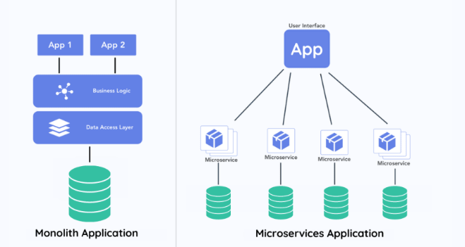
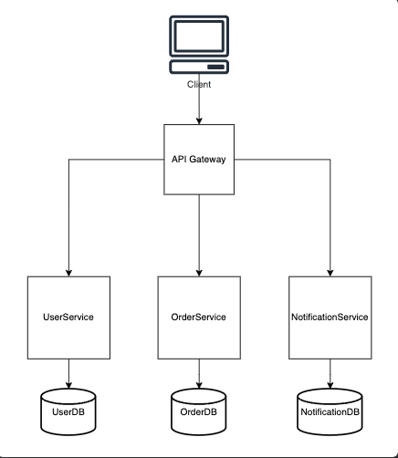
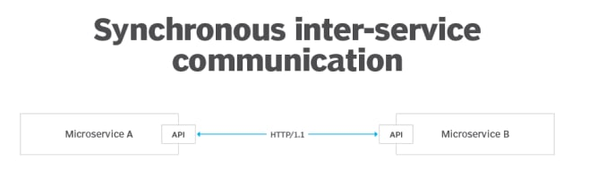
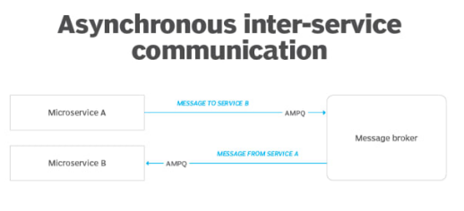
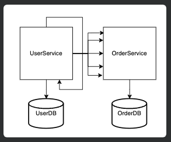
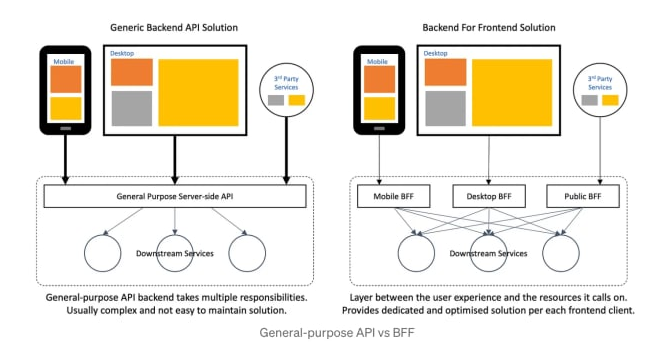
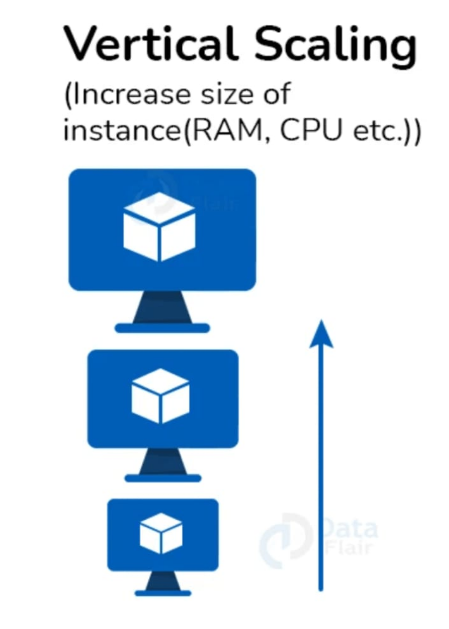
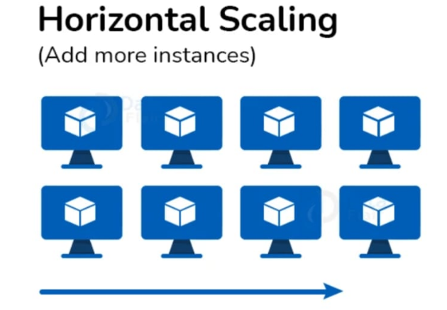
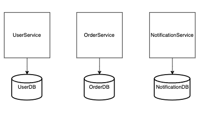

**Руководство по микросервисам**

**Оглавление:**
- [Почему именно микросервисы?](#почему-именно-микросервисы)
- [Пример архитектуры на основе микросервисов](#пример-архитектуры-на-основе-микросервисов)
- [Что такое Domain-Driven Design?](#что-такое-domain-driven-design)
- [Что такое распределенные службы?](#что-такое-распределенные-службы)
- [Что такое архитектура микросервисов?](#что-такое-архитектура-микросервисов)
- [Микросервисы и инфраструктура](#микросервисы-и-инфраструктура)
- [Как построить микросервис?](#как-построить-микросервис)
- [Как микросервисы взаимодействуют друг с другом?](#как-микросервисы-взаимодействуют-друг-с-другом)
  - [Межсервисная связь](#межсервисная-связь)
  - [Внутрисервисная коммуникация](#внутрисервисная-коммуникация)
- [Что такое болтливость в общении микросервисов?](#что-такое-болтливость-в-общении-микросервисов)
- [Как используется промежуточное ПО в микросервисах?](#как-используется-промежуточное-по-в-микросервисах)
- [Как соединить фронтенд с микросервисом?](#как-соединить-фронтенд-с-микросервисом)
- [Микросервисы + безопасность](#микросервисы--безопасность)
- [Тестирование микросервисов](#тестирование-микросервисов)
  - [Юнит-тестирование](#юнит-тестирование)
  - [Интеграционное тестирование](#интеграционное-тестирование)
- [Развертывание микросервисов в производственной среде](#развертывание-микросервисов-в-производственной-среде)
- [Масштабирование микросервисов](#масштабирование-микросервисов)
  - [Вертикальное масштабирование](#вертикальное-масштабирование)
  - [Горизонтальное масштабирование](#горизонтальное-масштабирование)
- [Общие проблемы и лучшие практики](#общие-проблемы-и-лучшие-практики)
- [Обработка транзакций базы данных](#обработка-транзакций-базы-данных)
- [DevOps при работе с микросервисами](#devops-при-работе-с-микросервисами)
  - [Автоматизация](#автоматизация)
  - [Контейнеризация](#контейнеризация)
  - [Мониторинг микросервисов](#мониторинг-микросервисов)
  - [Стратегии развертывания](#стратегии-развертывания)

## Почему именно микросервисы?

Микросервисы стали популярным архитектурным подходом для проектирования и создания программных систем по нескольким веским причинам и преимуществам. Это подход к проектированию, который предполагает разделение приложений на несколько отдельных и независимых сервисов, называемых "микросервисами", что дает несколько преимуществ, в том числе автономность каждого сервиса, что облегчает его поддержку и тестирование в изоляции по сравнению с монолитной архитектурой.

## Пример архитектуры на основе микросервисов

На рисунке показана простая архитектура на основе микросервисов, демонстрирующая независимую, изолированную природу сервисов. Каждая конкретная сущность, принадлежащая приложению, изолирована в своем сервисе. Например, UserService, OrderService и NotificationService работают с разными частями бизнеса.

Вся система разделена на сервисы, которые управляются независимыми командами, использующими собственные технологические стеки и даже масштабируемые независимо друг от друга.

В двух словах, каждый сервис работает со своей специфической областью бизнеса. Поэтому возникает вопрос: "Как разделить приложение на микросервисы?". Что ж, здесь микросервисы встречаются с Domain Driven Design (DDD).

## Что такое Domain-Driven Design?

Domain-Driven Design (DDD) - это подход к разработке программного обеспечения, в котором особое внимание уделяется моделированию программного обеспечения на основе области, которую оно обслуживает.

Он включает в себя понимание и моделирование домена или проблемного пространства приложения, способствуя тесному сотрудничеству между экспертами домена и разработчиками программного обеспечения. Такое сотрудничество создает общее понимание области и гарантирует, что разрабатываемое программное обеспечение будет в точности соответствовать ее тонкостям.

Это означает, что микросервисы - это не только выбор технологического стека для вашего приложения. Прежде чем создавать приложение, необходимо понять домен, с которым вы работаете. Это позволит вам узнать уникальные бизнес-процессы, выполняемые в вашей организации, что облегчит разбиение приложения на крошечные микросервисы.

Это позволит создать распределенную архитектуру, в которой ваши сервисы больше не нужно развертывать вместе на одной цели, а вместо этого они развертываются отдельно и могут быть развернуты на нескольких целях.

## Что такое распределенные службы?

Распределенные сервисы - это архитектура и подход к разработке программного обеспечения, при котором различные компоненты, модули или функции приложения распределяются между несколькими машинами или узлами в сети.

В современных вычислениях такой подход обычно используется для улучшения масштабируемости, доступности и отказоустойчивости. Как показано на рисунке выше, микросервисы являются естественными распределенными сервисами, поскольку каждый сервис изолирован от других и работает в своем собственном экземпляре.

## Что такое архитектура микросервисов?

## Микросервисы и инфраструктура

Архитектура микросервисов уделяет большое внимание инфраструктуре, поскольку способ развертывания и управления микросервисами напрямую влияет на эффективность и масштабируемость системы.

Существует несколько способов, с помощью которых архитектура микросервисов решает инфраструктурные вопросы.

1. **Контейнеризация**: Микросервисы часто упаковываются в контейнеры, например Docker, которые инкапсулируют приложение и его зависимости, обеспечивая согласованность между средами разработки, тестирования и производства. Контейнеризация упрощает развертывание и облегчает управление ресурсами инфраструктуры.

2. **Оркестрация**: Микросервисы обычно развертываются и управляются с помощью платформ оркестровки контейнеров, таких как Kubernetes. Kubernetes автоматизирует развертывание, масштабирование и управление контейнерными приложениями. Она обеспечивает эффективное распределение микросервисов по узлам инфраструктуры и возможность восстановления после сбоев.

3. **Обнаружение сервисов**: Микросервисы должны динамически обнаруживать и взаимодействовать друг с другом. Инструменты обнаружения сервисов, такие как etcd, Consul или встроенные в Kubernetes механизмы обнаружения сервисов, помогают находить и подключаться к микросервисам, запущенным на разных узлах инфраструктуры.

4. **Масштабируемость**: В архитектуре микросервисов особое внимание уделяется горизонтальному масштабированию, при котором дополнительные экземпляры микросервисов могут добавляться по мере необходимости, чтобы справиться с возросшей рабочей нагрузкой. Инфраструктура должна поддерживать динамическое распределение и масштабирование ресурсов в зависимости от потребностей.

## Как построить микросервис?

Первым шагом в создании микросервиса является разбиение приложения на набор сервисов. Разбиение монолитного приложения на микросервисы включает в себя процесс декомпозиции, в ходе которого вы определяете отдельные функциональные возможности внутри монолита и рефакторите их в отдельные, независимые микросервисы.

Этот процесс требует тщательного планирования и учета различных факторов, о которых пойдет речь ниже.

1. **Проанализируйте монолит**: Тщательно изучите существующее монолитное приложение, включая его архитектуру, зависимости и функциональность.
2. **Определите бизнес-возможности**: Определите отдельные бизнес-возможности или функциональные возможности монолита. Это могут быть функции, модули или сервисы, которые можно логически разделить.
3. **Определите границы сервиса**: Установите четкие границы для каждого микросервиса. Определите, за что будет отвечать каждый микросервис, и убедитесь, что эти обязанности согласованы и четко определены.
4. **Разделение данных**: Изучите зависимости данных и решите, как будет осуществляться обмен данными между микросервисами. Возможно, вам придется внедрить репликацию данных, синхронизацию данных и отдельные базы данных для каждого микросервиса.
5. **Коммуникационные протоколы**: Определите протоколы связи и API между микросервисами. Для межсервисного взаимодействия обычно используются RESTful API, gRPC или очереди сообщений.
6. **Отдельные кодовые базы**: Создайте отдельные кодовые базы для каждого микросервиса. Это может включать извлечение соответствующего кода и функциональности из монолита в отдельные репозитории или в виде пакетов в стратегии монорепо.
7. **Декомпозиция базы данных**: Если монолитное приложение опирается на единую базу данных, вам может понадобиться разделить ее на более мелкие базы данных или схемы внутри базы данных для каждого микросервиса.
8. **Реализуйте логику сервисов**: Разработайте бизнес-логику для каждого микросервиса. Убедитесь, что каждый микросервис может функционировать независимо и справляться со своими специфическими обязанностями.
9. **Интеграция и тестирование**: Создавайте тщательные интеграционные тесты, чтобы убедиться, что микросервисы могут взаимодействовать и работать вместе так, как ожидается. Используйте непрерывную интеграцию (CI) и автоматизированное тестирование для поддержания качества кода.
10. **Документация**: Ведите исчерпывающую документацию по каждому микросервису, включая документацию по API и руководство по использованию для разработчиков, которые будут взаимодействовать с сервисами.

После того как вы разделили сервисы, важно установить правильные стандарты взаимодействия микросервисов.

## Как микросервисы взаимодействуют друг с другом?

Коммуникация между сервисами - важный аспект, который необходимо учитывать при построении микросервисов. Поэтому, какой бы подход вы ни выбрали, важно обеспечить эффективность и надежность такой связи.

Существует две основные категории коммуникаций на основе микросервисов:

1. **Межсервисное взаимодействие**
2. **Внутрисервисная коммуникация**

### Межсервисная связь

Межсервисное взаимодействие в микросервисах относится к тому, как отдельные микросервисы общаются и взаимодействуют в рамках архитектуры микросервисов.

Микросервисы могут использовать два основных подхода к обмену сообщениями для взаимодействия с другими микросервисами в рамках межсервисной коммуникации.

**Синхронная связь**

Одним из подходов к организации межсервисного взаимодействия является синхронное взаимодействие. Синхронное взаимодействие - это подход, при котором служба вызывает другую службу по таким протоколам, как HTTP или gRPC, и ждет, пока та ответит ей.

---

---

Источник: https://www.theserverside.com/answer/Synchronous-vs-asynchronous-microservices-communication-patterns

Второй подход - это асинхронная передача сообщений. В этом случае служба отправляет сообщение, не ожидая немедленного ответа.

Затем, асинхронно, один или несколько сервисов обрабатывают сообщение в своем собственном темпе.

---

---

Источник: https://www.theserverside.com/answer/Synchronous-vs-asynchronous-microservices-communication-patterns

### Внутрисервисная коммуникация

Внутрисервисное взаимодействие в микросервисах относится к взаимодействию и общению внутри одного микросервиса, охватывая различные компоненты, модули и слои, составляющие этот микросервис.

Проще говоря, в отличие от межсервисной коммуникации, которая включает в себя взаимодействие между различными микросервисами, внутрисервисная коммуникация сосредоточена на внутренней работе одного микросервиса.

Но при любом подходе вы должны быть уверены, что создаете идеальный баланс коммуникаций, чтобы не допустить чрезмерного общения в ваших микросервисах. В противном случае это может привести к появлению "**болтливых**" микросервисов.

## Что такое болтливость в общении микросервисов?

Под "**болтливостью**" понимается ситуация, когда между микросервисами происходит чрезмерное или частое общение.

Это означает, что микросервисы делают много сетевых запросов или вызовов API друг к другу, что может иметь ряд последствий и проблем, таких как избыточная производительность, повышенная сложность, проблемы масштабируемости и сетевой трафик.

---

---

**Рисунок: Микросервис с поддержкой чата**

Как показано выше, UserService имеет избыточное взаимодействие с OrderService и самим собой, что может привести к проблемам с производительностью и масштабированием, так как происходит избыточное количество сетевых вызовов.

## Как используется промежуточное ПО в микросервисах?

Middleware (промежуточное ПО) играет важную роль в архитектуре микросервисов, предоставляя сервисы, инструменты и компоненты, которые облегчают коммуникацию, интеграцию и управление микросервисами. Давайте обсудим несколько вариантов его использования.

- **Межсервисная коммуникация**: Middleware предоставляет каналы связи и протоколы, которые позволяют микросервисам взаимодействовать друг с другом. Это могут быть брокеры сообщений, такие как RabbitMQ, Apache Kafka, RPC-фреймворки, такие как gRPC, или RESTful API.
- **Обнаружение сервисов**: Промежуточное ПО для обнаружения сервисов помогает микросервисам динамически находить и подключаться к другим микросервисам, особенно в динамических или контейнерных средах. В этом процессе помогают такие инструменты, как Consul, etcd или функции обнаружения сервисов Kubernetes.
- **Шлюз API**: Шлюз API - это компонент промежуточного ПО, который служит точкой входа для внешних клиентов в микросервисы. Он может обрабатывать аутентификацию, авторизацию, маршрутизацию запросов и агрегировать ответы от нескольких микросервисов.
- **Безопасность и аутентификация**: Компоненты Middleware часто предоставляют функции безопасности, такие как аутентификация, авторизация и шифрование, чтобы обеспечить безопасное взаимодействие между микросервисами. Для повышения безопасности используются такие инструменты, как OAuth2, JWT и шлюзы безопасности API.
- **Распределенная трассировка**: Middleware для распределенной трассировки, такие как Jaeger и Zipkin, помогают отслеживать запросы, проходящие через несколько микросервисов, что способствует отладке, оптимизации производительности и пониманию поведения системы.
- **Мониторинг и логирование**: В состав Middleware часто входят компоненты мониторинга и протоколирования, такие как ELK Stack, Prometheus и Grafana, для отслеживания состояния, производительности и поведения микросервисов. Это помогает в устранении неполадок и оптимизации производительности.

## Как соединить фронтенд с микросервисом?
Соединение фронтенда с сервисным уровнем заключается в выполнении HTTP-запросов к конечным точкам API, которые выставляются сервисным уровнем. Этими конечными точками API обычно являются конечные точки RESTful или GraphQL.

Это позволяет фронтенду взаимодействовать с бэкенд-сервисом и получать от него данные.

Паттерн BFF (Backend For Frontend) - это архитектурный паттерн, используемый для разработки приложений на основе микросервисов, особенно тех, которые имеют различные клиентские интерфейсы, такие как веб-интерфейс, мобильный интерфейс и другие устройства. Паттерн BFF предполагает создание отдельного бэкенд-сервиса для каждого фронтенд-приложения или типа клиента.

Рассматривайте приложение, обращенное к пользователю, как состоящее из двух компонентов: клиентского приложения, расположенного за пределами вашей системы, и серверного компонента, известного как BFF (Backend For Frontend), находящегося в пределах вашей системы. BFF является разновидностью паттерна API Gateway, но добавляет дополнительный слой между микросервисами и каждым типом клиента. Вместо одной точки входа в систему он представляет собой несколько шлюзов.

Такой подход позволяет создавать пользовательские API с учетом специфических требований каждого типа клиентов, например мобильных, веб-, настольных, голосовых помощников и т. д. Это избавляет от необходимости консолидировать все в одном месте. Более того, это позволяет сохранить ваши внутренние сервисы "чистыми" от специфических проблем с API, которые зависят от типа клиента: ваши внутренние сервисы могут обслуживать "чистые" API, управляемые доменом, а все специфические для клиента переводы находятся в BFF(s). Приведенная ниже диаграмма иллюстрирует эту концепцию.

---

---

Источник: https://medium.com/mobilepeople/backend-for-frontend-pattern-why-you-need-to-know-it-46f94ce420b0

## Микросервисы + безопасность
Безопасность - важнейший аспект при создании микросервисов. Только авторизованные пользователи должны иметь доступ к вашим API. Как же защитить свои микросервисы?

**Выберите механизм аутентификации**

Защитите свои микросервисы с помощью аутентификации на основе токенов (JWT или OAuth 2.0), ключей API или аутентификации на основе сеансов, в зависимости от требований вашего приложения.

**Централизованная служба аутентификации**

Если у вас несколько микросервисов, рассмотрите возможность использования централизованной службы аутентификации. Это позволит пользователям проходить аутентификацию один раз и получать токены для последующих запросов. Если вы используете API-шлюз, аутентификация и авторизация, как правило, будут централизованы в нем.

**Безопасная связь**

Убедитесь, что связь между микросервисами и клиентами зашифрована с помощью TLS (обычно HTTPS) или других безопасных протоколов, чтобы предотвратить прослушивание и перехват данных.

**Внедрение промежуточного ПО для аутентификации**

Каждый микросервис должен включать промежуточное ПО аутентификации для проверки входящих запросов. Проверка токенов или учетных данных и извлечение идентификационных данных пользователя.

**Проверка подлинности токена**

Для аутентификации на основе токенов проверяйте токены JWT или OAuth 2.0 с помощью библиотек или фреймворков, поддерживающих проверку токенов. Обеспечьте проверку срока действия токенов.

**Управление пользователями и ролями**

Реализуйте управление пользователями и ролями в каждом микросервисе или используйте внешнего поставщика идентификационных данных для управления идентификационными данными и разрешениями пользователей.

**Управление доступом на основе ролей (RBAC)**

Внедрите RBAC для определения ролей и разрешений. Назначайте роли пользователям и используйте их для контроля доступа к определенным конечным точкам или ресурсам микросервиса.

**Промежуточное ПО для авторизации**

Включите авторизационное промежуточное ПО в каждый микросервис, чтобы обеспечить контроль доступа на основе ролей и разрешений пользователей. Это промежуточное ПО должно проверять, есть ли у аутентифицированного пользователя необходимые разрешения для выполнения запрашиваемого действия.

**Тонко организованный контроль доступа**

Рассмотрите возможность реализации тонкого контроля доступа для управления доступом к отдельным ресурсам или записям данных в микросервисе на основе атрибутов пользователей, ролей или прав собственности.

## Тестирование микросервисов

### Юнит-тестирование
Юнит-тестирование микросервисов подразумевает изолированное тестирование отдельных компонентов или блоков микросервиса для обеспечения их корректной работы.

Эти тесты предназначены для проверки поведения наиболее мелких тестируемых частей микросервиса, таких как функции, методы или классы, без внешних зависимостей.

Например, в нашем микросервисе, который мы построили ранее, мы можем провести юнит-тестирование OrderService, подражая его базе данных и внешним вызовам API, и убедиться, что OrderService сам по себе работает без ошибок.

### Интеграционное тестирование
Интеграционное тестирование включает в себя проверку корректности работы различных микросервисов при взаимодействии с ними как с частью более крупной системы.

Эти тесты гарантируют, что интегрированные микросервисы могут обмениваться данными и эффективно взаимодействовать.

## Развертывание микросервисов в производственной среде

Развертывание микросервисов в производственной среде требует тщательного планирования и выполнения, чтобы обеспечить стабильность, надежность и масштабируемость вашего приложения. Давайте обсудим некоторые ключевые шаги и соображения, связанные с этим.

- **Контейнеризация и оркестровка**: Сначала нам нужно контейнеризировать микросервисы с помощью таких технологий, как Docker. Контейнеры обеспечивают согласованность в средах разработки, тестирования и производства. Используйте платформы оркестровки контейнеров, такие как Kubernetes, для управления и развертывания контейнеров в масштабе.
- **Инфраструктура как код (IaC)**: Определите свою инфраструктуру с помощью кода (IaC), чтобы автоматизировать предоставление ресурсов, таких как виртуальные машины, балансировщики нагрузки и базы данных. В этом могут помочь такие инструменты, как Terraform, Pulumi и AWS CloudFormation.
- **Непрерывная интеграция и непрерывное развертывание (CI/CD)**: Внедрите конвейер CI/CD для автоматизации сборки, тестирования и развертывания микросервисов. Этот конвейер должен включать модульные тесты, интеграционные тесты и автоматизированные шаги развертывания.
- **Конфигурация среды**: Поддерживайте отдельные конфигурации окружения, такие как development, staging и production, чтобы обеспечить согласованность и свести к минимуму человеческие ошибки при развертывании.
- **Управление секретами**: Безопасное хранение конфиденциальных данных конфигурации и секретов с помощью таких инструментов, как AWS Secrets Manager или HashiCorp Vault. Избегайте жесткого кодирования секретов в коде или конфигурационных файлах.
- **Мониторинг и протоколирование**: Внедрите решения для мониторинга и протоколирования, чтобы отслеживать состояние и производительность ваших микросервисов в режиме реального времени. В этом могут помочь такие инструменты, как Prometheus, Grafana и ELK Stack (Elasticsearch, Logstash, Kibana).

## Масштабирование микросервисов

Масштабирование микросервисов подразумевает регулирование мощности приложения на основе микросервисов для обработки возросших нагрузок, трафика или объема данных при сохранении производительности, надежности и отзывчивости. Масштабирование может осуществляться как вертикально (увеличение масштаба), так и горизонтально (уменьшение масштаба). Ключевым преимуществом архитектуры микросервисов по сравнению с монолитной архитектурой является возможность индивидуального масштабирования каждого микросервиса, что обеспечивает экономическую эффективность работы (обычно высокая нагрузка влияет только на конкретные микросервисы, а не на все приложение).

### Вертикальное масштабирование

Вертикальное масштабирование - это увеличение ресурсов отдельного экземпляра микросервиса, таких как процессор и память, для эффективного управления более высокими рабочими нагрузками.

Главный плюс этого подхода - нет необходимости беспокоиться об архитектуре нескольких экземпляров одного и того же микросервиса и о том, как их координировать и синхронизировать. Это простой подход, не требующий изменения архитектуры или кода. Недостатки этого подхода: а) вертикальное масштабирование в конечном итоге ограничено (в одном экземпляре можно выделить только столько оперативной памяти и процессора) и быстро становится дорогостоящим; б) может потребоваться некоторое время простоя, поскольку во многих случаях вертикальное масштабирование экземпляра предполагает создание нового, большего экземпляра, а затем перенос вашего микросервиса для работы на новом экземпляре.

---

---

### Горизонтальное масштабирование

Горизонтальное масштабирование подразумевает добавление большего количества экземпляров микросервисов для распределения рабочей нагрузки и обработки возросшего трафика. Во многих случаях это рекомендуемый подход к масштабированию, поскольку он дешевле (в большинстве случаев) и обеспечивает "бесконечное масштабирование". Кроме того, при таком методе очень легко отменить масштабирование - достаточно удалить несколько экземпляров. Однако он требует определенного архитектурного планирования для обеспечения того, чтобы несколько экземпляров одного и того же микросервиса "хорошо играли" друг с другом с точки зрения согласованности данных, координации и синхронизации, проблем с привязкой к сессии и отсутствия блокировки взаимных ресурсов.

## Общие проблемы и лучшие практики

Архитектура микросервисов обладает многочисленными преимуществами, но при этом имеет свои сложности.

**Масштабируемость**

- **Проблема**: масштабирование отдельных микросервисов при сохранении общей производительности системы может оказаться непростой задачей.
- **Лучшие практики**: Реализуйте автоматическое масштабирование на основе метрик реального времени. Используйте платформы оркестровки контейнеров, такие как Kubernetes, для эффективного масштабирования. Проводите тестирование производительности для выявления узких мест.

**Безопасность**

- **Проблема**: Обеспечение безопасности в нескольких микросервисах и управление аутентификацией и авторизацией может быть сложной задачей.
- **Лучшие практики**: Реализуйте модель безопасности с нулевым доверием с надлежащей аутентификацией, например OAuth 2.0, и авторизацией, например RBAC. Используйте API-шлюзы для обеспечения безопасности. Регулярно обновляйте и исправляйте зависимости, чтобы устранить уязвимости в системе безопасности.

**Развертывание и DevOps**

- **Задача**: Координация развертывания и управление конвейером CI/CD для большого количества микросервисов может оказаться сложной задачей.
- **Лучшие практики**: Внедрите надежный конвейер CI/CD с автоматизированными процессами тестирования и развертывания. Используйте контейнеризацию, например Docker, и оркестровку контейнеров, например Kubernetes, для обеспечения согласованности и масштабируемости. Убедитесь, что каждый микросервис полностью независим в плане развертывания.

**Версионирование и управление API**

- **Задача**: Управление версиями API и обеспечение обратной совместимости очень важны, когда от API зависит множество сервисов.
- **Лучшие практики**: Используйте версионированные API и по возможности вносите изменения, совместимые с обратными версиями. Внедряйте API-шлюзы для управления версиями и преобразования.

**Мониторинг и отладка**

- **Задача**: Отладка и мониторинг микросервисов в распределенной системе затруднены. Гораздо проще отследить поток запросов в монолите по сравнению с отслеживанием запросов, которые обрабатываются распределенным образом.
- **Лучшие практики**: Внедрите централизованное протоколирование и используйте инструменты распределенной трассировки, такие как Zipkin и Jaeger, для отслеживания запросов между сервисами. Внедрите проверки работоспособности и метрики для мониторинга.

## Обработка транзакций базы данных
Обработка транзакций базы данных в архитектуре микросервисов может быть сложной из-за распределенного характера системы.

Микросервисы часто имеют собственные базы данных, и обеспечение согласованности данных и поддержание целостности транзакций между сервисами требует тщательного планирования и использования соответствующих стратегий.

**База данных на микросервис**

Как показано выше, наличие единой базы данных для каждого микросервиса помогает принять лучшие требования к моделированию данных и даже позволяет независимо масштабировать базу данных. Таким образом, вы получаете больше гибкости при устранении узких мест на уровне БД.

Поэтому при создании микросервисов часто рекомендуется использовать отдельную базу данных для каждого сервиса. Но есть некоторые моменты, которые следует учитывать при этом:

1. **Микросервисы и изоляция данных(Microservices and Data Isolation)**: Каждый микросервис должен иметь свою базу данных. Такая изоляция позволяет сервисам управлять данными независимо, не вмешиваясь в работу других сервисов.
2. **Распределенные транзакции(Distributed Transactions)**: По возможности избегайте распределенных транзакций. Они могут быть сложны в реализации и негативно влиять на производительность системы. Используйте их в крайнем случае, когда нет других вариантов.
3. **Согласованность в конечном счёте(Eventual Consistency)**: Примите модель конечной согласованности. В архитектуре микросервисов часто допустимо, чтобы данные временно не согласовывались между сервисами, но в конечном итоге сходились к согласованному состоянию.
4. **Примите паттерн Saga(Adopt The Saga Pattern)**: Реализуйте паттерн Saga для управления длительными и многоэтапными транзакциями в нескольких микросервисах. Саги состоят из локальных транзакций и компенсирующих действий для поддержания согласованности.

## DevOps при работе с микросервисами

Практики DevOps необходимы при работе с микросервисами для обеспечения бесперебойного взаимодействия между командами разработчиков и операционных служб, автоматизации процессов и поддержания гибкости и надежности, необходимых в архитектуре микросервисов.

Вот некоторые критические соображения для DevOps с микросервисами:

### Автоматизация
**Непрерывная интеграция (CI)**

Внедрите конвейеры CI, которые автоматически собирают, тестируют и упаковывают микросервисы при каждом изменении кода в репозиториях контроля версий.

**Непрерывная доставка/развертывание (CD)**

Автоматизируйте процесс развертывания новых версий микросервисов в различных средах, таких как предварительный просмотр, постановка и производство.

**Инфраструктура как код (IaC)**

Используйте инструменты IaC, такие как Terraform, Pulumi или AWS CloudFormation, для автоматизации создания и настройки инфраструктурных ресурсов, включая контейнеры, виртуальные машины, сетевые ресурсы, ресурсы хранения и т. д.

### Контейнеризация
Используйте технологии контейнеризации, такие как Docker, для последовательной упаковки микросервисов и их зависимостей. Это гарантирует, что микросервисы смогут стабильно работать в различных средах. Внедрите платформы оркестровки контейнеров, такие как Kubernetes или Docker Swarm, для автоматизации развертывания, масштабирования и управления контейнерными микросервисами.

### Мониторинг микросервисов

Внедрите инструменты мониторинга и наблюдаемости для отслеживания состояния и производительности микросервисов в режиме реального времени. Собирайте метрики, журналы и трассировки, чтобы быстро диагностировать проблемы. Для комплексного мониторинга используйте такие инструменты, как Prometheus, Grafana, ELK Stack (Elasticsearch, Logstash, Kibana), а также распределенную трассировку, например Zipkin или Jaeger.

### Стратегии развертывания

Внедряйте такие стратегии развертывания, как "сине-зеленые" развертывания и "канареечные" релизы, чтобы минимизировать время простоя и риски при развертывании новых версий микросервисов. Автоматизируйте откат при обнаружении проблем после развертывания, чтобы обеспечить быстрый процесс восстановления.