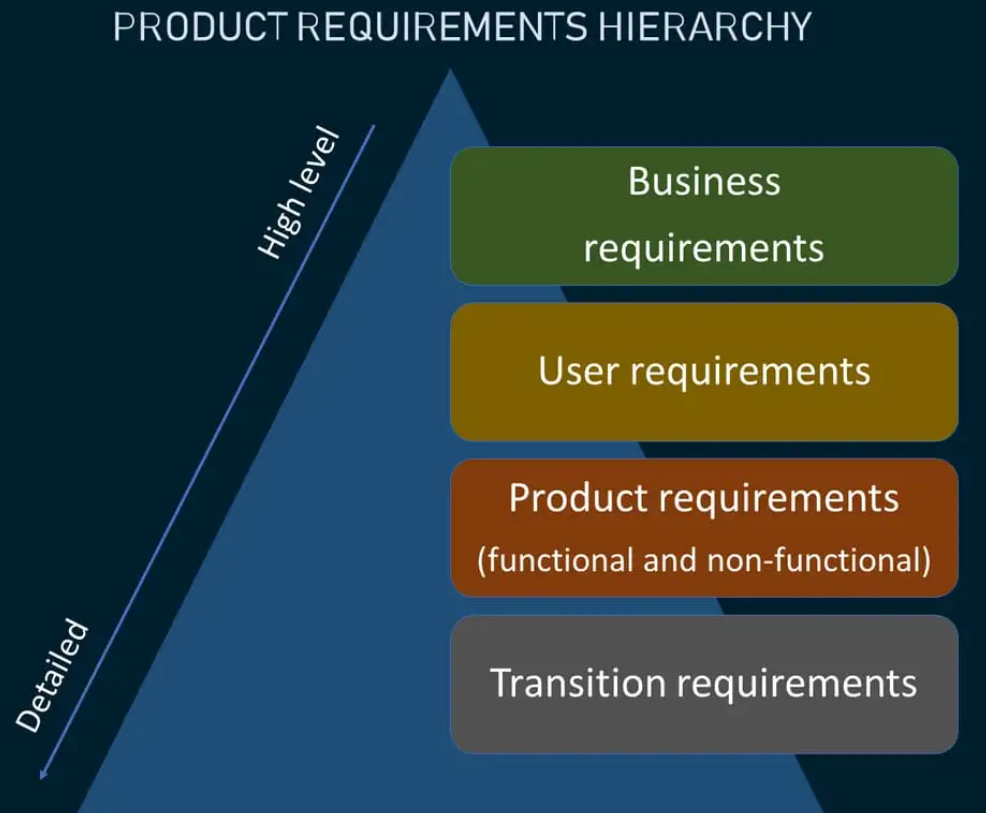
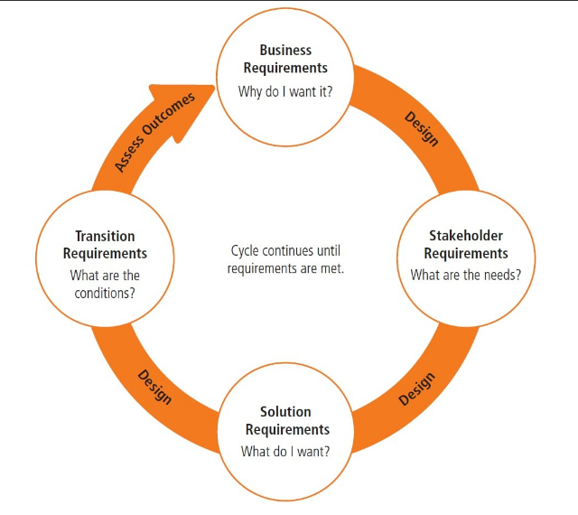

# Иерархия требований к продукту 

## Business reauirements (Бизнес требования)

**Бизнес требования** определить стратегический путь проекта. Они включают в себя требования проекта высокого уровня, которые описывают общую бизнес-цель с точки зрения компании. Цель может заключаться в увеличении прибыли или захвате большей доли рынка. Исходя из объема, бизнес-требования могут быть такими же простыми, как пара строк, описывающих ключевые бизнес-потребности или очень сложный набор целей в разных рабочих областях.

## User or Stakeholder reauirements (Требования пользователей или заинтересованных сторон)

**Требования пользователей**, также называемые требованиями заинтересованных сторон, - это утверждения, описывающие, какую ценность отдельные группы пользователей (клиенты, менеджеры и т. д.) ожидают от определенного решения. Эти требования часто рассматриваются как связующее звено между общими бизнес-требованиями и конкретными требованиями к системе.

**Сбор требований пользователей Простые шаги**

Выявление требований пользователей необходимо для разработки системы, отвечающей их ожиданиям. Существует несколько эффективных методов сбора информации. В следующей таблице описаны некоторые из этих методов, а также их достоинства и области применения.

| Техника                              | Сильные стороны                                                                              | Рекомендуемые области применения                                                        |
|--------------------------------------|----------------------------------------------------------------------------------------------|-----------------------------------------------------------------------------------------|
| Интервью                             | Прямая обратная связь, личное участие, глубокое понимание                                    | Ранние стадии проекта, индивидуальный вклад заинтересованных сторон                     |
| Анкеты                               | Количественные данные, широкий охват, легкость анализа                                       | Большие группы пользователей, удаленные заинтересованные стороны, статистический анализ |
| Фокус-группы                         | Совместные обсуждения, различные точки зрения, немедленное взаимодействие                    | Исследовательские этапы, тестирование концепции продукта                                |
| Наблюдение/этнография                | Контекст реального мира, выявление неявных потребностей, понимание поведения                 | Изучение пользовательской среды, анализ моделей использования                           |
| User Stories (Истории пользователей) | Ориентированные на пользователя, повествовательные, четкие требования                        | Agile-разработка, спецификация функций                                                  |
| Use Cases (Примеры использования)    | Детализация взаимодействия систем, требования на основе сценариев                            | Функциональные требования, критерии приемочного тестирования                            |
| Прототипирование                     | Обратная связь с материальным продуктом, итеративный дизайн, вовлечение пользователей        | Разработка пользовательского интерфейса, демонстрация функциональности системы          |
| Workshops                            | Групповое сотрудничество, выяснение обстоятельств в режиме реального времени, мозговой штурм | Согласование работы межфункциональной команды, уточнение требований                     |

## Product requirements (Требования к продукту)

Требования к продукту, также называемые требованиями к решению, - это конкретные описания возможностей и качеств, которыми должно обладать решение, чтобы соответствовать требованиям пользователей и самого бизнеса. Они имеют определенный уровень детализации, позволяющий эффективно разрабатывать и внедрять решение. Требования к продукту делятся на две категории:

**функциональные требования**, которые описывают возможности и функции, которыми должно обладать решение с точки зрения поведения, и
**нефункциональные требования**, которые описывают общие условия правильного функционирования решения, соответственно, также известные как требования к качеству обслуживания.

## Transition requirements (Переходные требования)

Переходные требования описывают условия, которые должны быть учтены, а также все возможности нового решения, чтобы осуществить переход от текущего состояния системы **(AS-IS)** в целевое состояние **(TO-BE)**.

_Эти требования являются временными и действуют только в момент миграции системы или решения между состояниями._

_Переходные требования должны обеспечивать эффективный и успешный процесс перехода на новое разработанное решение с учетом всех остальных видов требований (бизнес, функциональные, нефункциональные)_

Переходные требования включают в себя:
- Правила преобразования и миграции данных (Сопоставление источника и цели документа, диаграммы потоков и миграции данных)
- Менеджмент и стратегия изменений
- Роли доступов
- Пользовательское тестирование (UAT)
- Инструкции пользователей и администраторов
- Обучение пользователей и стейкхолдеров
- Инфраструктурные изменения

