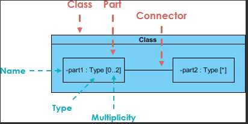

**Руководство по типам диаграмм UML**

**Структурные диаграммы** показывают, что находится в моделируемой системе. Говоря более техническим языком, они показывают различные объекты в системе. 

**Поведенческие диаграммы** показывают, что должно происходить в системе. Они описывают, как объекты взаимодействуют друг с другом, чтобы создать функционирующую систему.

**Структурные диаграммы**
- [Диаграмма классов](#диаграмма-классов)
- [Диаграмма компонентов](#диаграмма-компонентов)
- [Диаграмма развертывания](#диаграмма-развертывания)
- [Диаграмма объектов](#диаграмма-объектов)
- [Диаграмма пакетов](#диаграмма-пакетов)
- [Диаграмма профиля](#диаграмма-профиля)
- [Диаграмма композитной структуры](#диаграмма-композитной-структуры)
- [Диаграмма вариантов использования](#диаграмма-вариантов-использования)
- [Диаграмма деятельности (Activity Diagram)](#диаграмма-деятельности-activity-diagram)
- [Диаграмма состояний](#диаграмма-состояний)
- [Диаграмма последовательности](#диаграмма-последовательности)
- [Диаграмма коммуникации](#диаграмма-коммуникации)
- [Обзорная диаграмма взаимодействия](#обзорная-диаграмма-взаимодействия)
- [Временная диаграмма](#временная-диаграмма)

**Поведенческие диаграммы**
- [Диаграмма классов](#диаграмма-классов)
- [Диаграмма компонентов](#диаграмма-компонентов)
- [Диаграмма развертывания](#диаграмма-развертывания)
- [Диаграмма объектов](#диаграмма-объектов)
- [Диаграмма пакетов](#диаграмма-пакетов)
- [Диаграмма профиля](#диаграмма-профиля)
- [Диаграмма композитной структуры](#диаграмма-композитной-структуры)
- [Диаграмма вариантов использования](#диаграмма-вариантов-использования)
- [Диаграмма деятельности (Activity Diagram)](#диаграмма-деятельности-activity-diagram)
- [Диаграмма состояний](#диаграмма-состояний)
- [Диаграмма последовательности](#диаграмма-последовательности)
- [Диаграмма коммуникации](#диаграмма-коммуникации)
- [Обзорная диаграмма взаимодействия](#обзорная-диаграмма-взаимодействия)
- [Временная диаграмма](#временная-диаграмма)

# Диаграмма классов
Диаграммы классов - это основной строительный блок любого объектно-ориентированного решения. Она показывает классы в системе, атрибуты и операции каждого класса, а также отношения между ними.
 
В большинстве инструментов моделирования класс состоит из трех частей. Имя вверху, атрибуты в середине и операции или методы внизу. В большой системе с множеством связанных классов классы группируются вместе для создания диаграмм классов. Различные отношения между классами отображаются с помощью стрелок разных типов.
 
Ниже приведено изображение диаграммы классов. 

# Диаграмма компонентов

Диаграмма компонентов отображает структурную взаимосвязь компонентов программной системы. В основном они используются при работе со сложными системами, состоящими из множества компонентов. Компоненты взаимодействуют друг с другом с помощью интерфейсов. Интерфейсы связаны между собой с помощью коннекторов. На рисунке ниже показана диаграмма компонентов.

# Диаграмма развертывания

Диаграмма развертывания показывает аппаратное обеспечение вашей системы и программное обеспечение на этом оборудовании. Диаграммы развертывания полезны, когда ваше программное решение развертывается на нескольких машинах, каждая из которых имеет уникальную конфигурацию. Ниже приведен пример диаграммы развертывания.

# Диаграмма объектов

Диаграммы объектов, иногда называемые диаграммами экземпляров, очень похожи на диаграммы классов. Как и диаграммы классов, они также показывают отношения между объектами, но в них используются примеры из реального мира.

Они показывают, как будет выглядеть система в определенный момент времени. Поскольку в объектах имеются данные, они используются для объяснения сложных отношений между объектами.

# Диаграмма пакетов

Как следует из названия, диаграмма пакетов показывает зависимости между различными пакетами в системе. 

# Диаграмма профиля

Диаграмма профиля — это структурная диаграмма UML, которая используется для расширения стандартной нотации UML, чтобы адаптировать ее под конкретные потребности и предметные области проекта.

Диаграмма профиля позволяет расширить стандартную нотацию UML путем создания новых элементов и отношений, которые отражают специфические требования и особенности предметной области проекта. Это особенно полезно, когда нотация UML не обладает достаточным набором символов, чтобы описать все аспекты системы.

На диаграмме профиля вы можете определить свои собственные стереотипы, которые представляют новые типы элементов, а также добавить новые атрибуты и операции к существующим элементам. Стереотипы — это своего рода метки, которые вы назначаете элементам, чтобы указать их специальное назначение или роль в системе.

Основная идея диаграммы профиля заключается в том, чтобы помочь вам создать язык моделирования, который наиболее точно отражает особенности вашего проекта. Это позволяет разработчикам и аналитикам лучше понять систему и взаимодействовать друг с другом, используя общую нотацию.

Примером использования диаграммы профиля может быть разработка модели для конкретной отрасли, например, финансового сектора или здравоохранения. В этих отраслях могут быть свои уникальные аспекты и правила, которые необходимо учесть при моделировании системы. Диаграмма профиля позволяет вам создавать новые символы, отношения и правила, которые соответствуют этим особенностям.

# Диаграмма композитной структуры

Диаграмма композитной структуры — это структурная диаграмма UML, которая предоставляет логическое представление всей или части программной системы и включает в себя классы, интерфейсы, пакеты и их взаимосвязи. Она позволяет показать внутреннюю структуру (включая части и соединители) структурированного классификатора или сотрудничества.

Диаграмма композитной структуры выполняет сходную функцию с диаграммой классов, но позволяет более подробно описать внутреннюю структуру нескольких классов и показать взаимодействия между ними. Она дает возможность графически представить внутренние классы и части, а также показать ассоциации как между классами, так и внутри них.

Диаграмма композитной структуры помогает лучше понять организацию и взаимодействие компонентов программной системы. Она позволяет визуализировать, как классы, интерфейсы и пакеты связаны друг с другом. Например, вы можете показать, что класс содержит другие классы в качестве своих внутренних частей, а также указать ассоциации между различными классами.

Эта диаграмма предоставляет гибкую возможность для детального анализа внутренней структуры системы. Вы можете рассмотреть взаимодействия между несколькими классами, определить, какие компоненты являются частями других компонентов, и как они взаимодействуют между собой. Также можно визуально представить вложенные классы и части системы, улучшая понимание их взаимосвязей и взаимодействий.

Диаграмма композитной структуры позволяет создавать наглядные и информативные представления внутренней структуры программных систем, помогая разработчикам и аналитикам лучше понять, как различные компоненты взаимодействуют друг с другом и как они организованы в системе.

**Цель диаграммы композитной структуры**

Диаграммы композитной структуры позволяют пользователям «заглянуть внутрь» объекта и увидеть, из чего он состоит. Они предоставляют возможность подробно описать внутренние действия класса, включая связи с вложенными классами.

В диаграммах композитной структуры объекты представлены как композиция других классифицированных объектов. Это означает, что объект состоит из других объектов, которые являются его частями.

# Диаграмма вариантов использования

Как наиболее известный тип диаграмм из поведенческих типов UML, диаграммы вариантов использования дают графический обзор участников системы, различных функций, необходимых этим участникам, и того, как эти различные функции взаимодействуют.

Это отличная отправная точка для обсуждения любого проекта, поскольку вы можете легко определить основных участников и основные процессы системы. 

# Диаграмма деятельности (Activity Diagram)

Диаграммы деятельности представляют рабочие процессы в графическом виде. Они могут использоваться для описания бизнес-процессов или рабочих процессов любого компонента системы. Иногда диаграммы деятельности используются в качестве альтернативы диаграммам машин состояний. 

# Диаграмма состояний

Диаграмма состояний (State diagram) — это один из видов диаграмм UML, используемых в разработке программного обеспечения, чтобы визуализировать и моделировать поведение объекта или системы в различных состояниях. Она позволяет описать все возможные состояния объекта, а также переходы между ними в ответ на определенные события.

# Диаграмма последовательности

Диаграммы последовательностей в UML показывают, как объекты взаимодействуют друг с другом и в каком порядке эти взаимодействия происходят. Важно отметить, что они показывают взаимодействие для конкретного сценария. Процессы изображаются вертикально, а взаимодействия - в виде стрелок. 

# Диаграмма коммуникации

Диаграмма коммуникации UML является подвидом диаграмм взаимодействия, используемых для визуализации и моделирования взаимодействия между объектами или компонентами в системе. Она показывает связи и порядок обмена сообщениями, между различными участниками в системе.

# Обзорная диаграмма взаимодействия

Обзорная диаграмма взаимодействия является одним из типов диаграмм взаимодействия UML и представляет собой графическое представление взаимодействия между различными элементами системы. Эта диаграмма позволяет визуализировать и описать поток выполнения событий в системе, объединяя другие диаграммы взаимодействия, такие как диаграммы последовательности и диаграммы коммуникации.

Обзорная диаграмма взаимодействия используется для представления сложных взаимодействий между различными объектами или компонентами системы. Она позволяет объединить несколько диаграмм взаимодействия в одну общую структуру, что помогает упростить и улучшить понимание системы и ее поведения. Обзорные диаграммы взаимодействия фокусируются на общем представлении потока управления, где узлами являются взаимодействия (sd) или ссылки на взаимодействия (ref). Взаимодействия — это взаимодействия между объектами, которые могут включать передачу сообщений или выполнение определенных действий. Ссылки на взаимодействия — это ссылки на диаграммы взаимодействия, которые используются повторно для упрощения моделирования.

На обзорной диаграмме взаимодействия элементы системы представлены в виде прямоугольников, называемых фреймами. Фреймы содержат другие диаграммы взаимодействия, которые отображают поток выполнения событий в системе. Поток выполнения определяется взаимодействием между различными объектами или компонентами системы и может отображаться в виде последовательности или параллельных ветвей.

# Временная диаграмма

Временные диаграммы очень похожи на диаграммы последовательности. Они представляют поведение объектов в заданном временном интервале. Если речь идет только об одном объекте, диаграмма проста. Но если речь идет о нескольких объектах, диаграмма Timing используется для отображения взаимодействия между объектами в течение данного промежутка времени.

