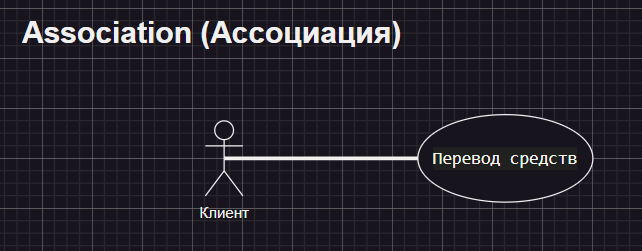

## Use Case UML

[Диаграммы примеры](/Use%20Case/Use%20Case%20Diagram%20Example/ "Примеры диаграмм")

## Оглавление:

- [Relationships (Отношения)](#relationships-отношения)
- [Association Relationship (Отношения ассоциации)](#association-relationship-отношения-ассоциации)
- [Include Relationship (Отношение включения)](#include-relationship-отношение-включения)

Use Case диаграмма - это тип диаграммы унифицированного языка моделирования (UML), которая представляет взаимодействие между участниками (пользователями или внешними системами) и рассматриваемой системой для достижения конкретных целей. Он обеспечивает высокоуровневое представление о функциональности системы, иллюстрируя различные способы взаимодействия пользователей с ней.

1. **Actor** - это внешние объекты, которые взаимодействуют с системой. Они могут включать пользователей, другие системы или аппаратные устройства. В контексте диаграммы вариантов использования участники инициируют случаи использования и получают результаты. Правильная идентификация и понимание действующих лиц имеют решающее значение для точного моделирования поведения системы.
   
2. **Use Case** похожи на сцены в пьесе. Они представляют конкретные вещи, которые может сделать ваша система. В системе онлайн-покупок примерами вариантов использования могут быть “ Разместить заказ ”, “ Отследить доставку” или “ Обновить информация о продукте ”. 
   
3. **Граница системы** - это визуальное представление области действия или пределов системы, которую вы моделируете. Он определяет, что внутри системы, а что снаружи. Граница помогает установить четкое различие между элементами, которые являются частью системы, и элементами, которые являются ее внешними. Граница системы обычно представлена прямоугольной рамкой, которая окружает все варианты использования системы.
   
**Цель границы системы**:
- **Определение области**: Он четко очерчивает границы системы, указывая, какие компоненты являются внутренними для системы, а какие являются внешними субъектами или объектами, взаимодействующими с системой.
- **Сосредоточиться на актуальности:** Определяя область действия системы, диаграмма может быть сосредоточена на иллюстрации основных функций, предоставляемых системой, без ненужных подробностей о внешних объектах.

# Relationships (Отношения)

В диаграмме вариантов использования связи играют решающую роль в изображении взаимодействий между участниками и вариантами использования. Эти отношения дают полное представление о функциональности системы и ее различных сценариях.

# Association Relationship (Отношения ассоциации)

Отношения ассоциации представляют собой связь или взаимодействие между агентом и сценарием использования. Она изображается линией, соединяющей актера с вариантом использования. Эта связь означает, что агент вовлечен в функциональность, описанную в сценарии использования.

**Пример: Система онлайн-банкинга**

- **Actor:** Клиент
- **Use Case:** Перевод средств
- **Association:** Линия, соединяющая Actor "Клиент" с Use Case "Перевод средств", указывающая на участие клиента в процессе перевода средств.

# Include Relationship (Отношение включения)

**Отношение включения** указывает на то, что вариант использования включает в себя функциональность другого варианта использования. Она обозначается пунктирной стрелкой, направленной от включающего варианта использования к включаемому варианту использования. Это отношение способствует модульному и многократно используемому дизайну.

**Пример: Постинг в социальных сетях**

**Use Case:** Составить сообщение, Добавить изображение

**Include Relationship:** Вариант использования "Составить пост" включает в себя функциональность "Добавить изображение". Таким образом, создание сообщения включает в себя действие добавления изображения.

